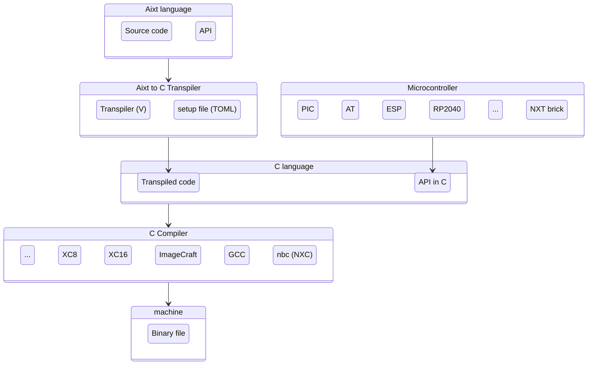

# Aixt Project

Aixt is a programming framework for microcontrollers which uses a modern language syntax and is focused on low-resource devices. This project is composed by 3 main components:

- The **Aixt** programing language based on the [_V language_](https://vlang.io/) syntax.
- The **Aixt to C Transpiler**, which translate de **Aixt** source code to _C_, for a expecific _C_ compiler of each microcontroller.
- The **Aixt API**, which makes the programming easy by standardizing the setup and I/O functions.  



## Aixt Language

**Aixt** programing language implements a subset of [_V language_](https://vlang.io/). The main difference is all variables in **Aixt** are mutable by default.

### Example with `main` function
```go
/* Turning ON a LED (XC16 compiler)
working on the PORTB pin 0 of a PIC24FJ microcontroller*/

import machine { pin }

fn main() {
    pin_mode(b0, out)     
    pin_high(b0)    //turn ON the PORTB0
}
```

### Example without `main` function (Script mode)
```go
/*blinking LED example (XC16 compiler)
working on the PORTB pin 0 of a PIC24FJ microcontroller*/

import machine { pin }
import time { sleep_ms }

pin_mode(b0, out)

for {   //infinite loop
    pin_high(b0)
    sleep_ms(500)
    pin_low(b0)
    sleep_ms(500)
}
```

## Aixt Transpiler

The transpiler is written in _V_ using the _V's_ native self-compiler (a transpiler from _V_ to _C_). This is implemented in the folders `\aixt_build`, `\aixt_cgen` and `\aixt_pref`, and the main source code is the `aixt.v` file.

## Aixt API

The **Aixt API** is inspired by _Micropython_, _Arduino_ and _Tinygo_ projects. The API for all the ports includes at least functions for:
- Digital input/output
- Analog inputs (ADC)
- PWM outputs
- Serial port (UART)

#### Project's name
The project's name is inspired in _Veasel_, the Weasel pet of _V Language_, and at the same time is a tribute to _Ticuna_ people who live in the Amazonic forest in the borders of _Colombia_, _Brasil_ and _Perú_. Weasels are _mustelids_ just like otters, so the name **Aixt** comes from _Aixtü_, which is a way to say otter in [_Ticuna_](https://www.sil.org/system/files/reapdata/90/20/51/90205190508691852389084667097660892450/tca_Ticuna_Dictionary_2016_web.pdf) language.
