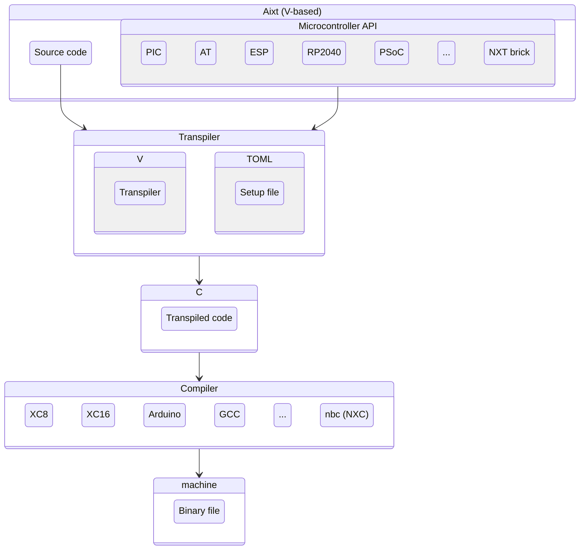

<div align="center">

<h1>Programming Framework for Microcontrollers</h1>
</div>

Aixt is a programming framework for microcontrollers which uses a modern language syntax based on [_V_](https://vlang.io/) and able to be used by low-resource devices. Aixt is composed by 3 main components:

- The **Aixt** programming language based on the [_V language_](https://vlang.io/) syntax.
- The **Aixt to C Transpiler**, which translate the **Aixt** source code to _C_, for the specific _C_ compiler of each microcontroller.
- The **Aixt API**, which makes the programming easy by standardizing the setup and I/O functions.  

This diagram shows the Aixt blocks and their interactions:



Aixt is designed as modular as possible to facilitate the incorporation of new devices and boards. This is mainly possible by using a configuration file (in TOML format) instead of creating new source code for each new device. That `.TOML` file contains the specific parameters of each device, board or compiler such as: variable types, initialization commands, compiler paths, etc.


## Aixt to C Transpiler

The transpiler is written in [_V_](https://vlang.io/) and uses _V's_ native compiler facilities to transpile from _V_ to _C_. This is implemented in the folders `\aixt_build` and `\aixt_cgen`, and the main source code is the `aixt.v` file. It generates code for 3 different backends:
- **c**: for the microcontroller native C compiler
- **nxc**: for the NXC compiler (LEGO Mindstorms NXT)
- **arduino**: for the Arduino IDE **WIP...**


## Aixt Language

**Aixt** programing language implements a subset of the [_V language_](https://vlang.io/). The main differences are show as follows:

feature                 |V                                  | Aixt
------------------------|-----------------------------------|----------------------------------------
variables               | immutable by default              | mutable by default
strings                 | dynamic-sized                     | dynamic-sized (only if supported)
arrays                  | dynamic-sized                     | dynamic-sized (only if supported)
default integers size   | 32 bits                           | depends on the device  
structs                 | allow functions (object-oriented) | don't allow functions (only structured)
functions               | only one return value             | multiple return values


### Example with `main` function

```v
/* Turning ON by 5.5 seconds the onboard LED 10 in the Explorer16 
board with a PIC24FJ microcontroller (XC16 compiler) */
import time { sleep_ms }
import pin { high, low }

fn main() {
    high(led10)    //turn ON the LED 10 (PORTA7)
    sleep_ms(5500)
    low(led10)
}
```

### Example without `main` function (Script mode)

```v
// Blinking LEDs on the Seeeduino XIAO-SAM21 board (Arduino backend)
import time
import pin

pin.setup(2, pin.output)
pin.setup(3, pin.output)

for i in 0 .. 10 { // 10 times
	pin.high(2)
	time.sleep_ms(250)
	pin.low(2)
	time.sleep_ms(250)
}

for {
	pin.high(3)
	time.sleep(1)
	pin.low(3)
	time.sleep(2)
}
```

## Aixt API

The **Aixt API** is inspired by _Micropython_, _Arduino_ and _Tinygo_. The API for all the ports includes at least functions for:

- Digital input/output
- Analog inputs (ADC)
- PWM outputs
- Serial port (UART)

## Using Aixt

First compile `aixt.v`: 
```
cd aixt
v aixt.v
```

run it in a Linux-based system as:
```
./aixt <command> <device_or_board> <source_file>
```
or in Windows:
```
aixt.exe <command> <device_or_board> <source_file>
```

### Running examples:

```
./aixt -t Emulator test.v
```
```
./aixt -b NXT ports/NXT/projects/1_motor_forward.v
```

## Project's name

The project's name is inspired in _Veasel_, the Weasel pet of _V Language_, and at the same time is a tribute to _Ticuna_ people who live in the Amazon forest between the borders of _Colombia_, _Brasil_ and _Perú_. Weasels are _mustelids_ just like otters, so the name **Aixt** comes from _Aixtü_, which is a way to say otter in [_Ticuna_](https://www.sil.org/system/files/reapdata/90/20/51/90205190508691852389084667097660892450/tca_Ticuna_Dictionary_2016_web.pdf) language.

## Have questions?

Nice, you can contact me via mail.

Email: fmartinezsanta@gmail.com
<!-- Discord : https://discord.gg/-->

## Want to contribute?

Cool, go ahead and make the contributions you want, then submit a new pull request

The microcontroller or board that you use is not listed [here](docs/Devices%20and%20Boards.md) and you know how to program it in C?... You can easily add it to Aixt, please check [CONTRIBUTING.md](CONTRIBUTING.md).

Take a look at [TODO.md](TODO.md) to find a task for you.

Please check [CONTRIBUTING.md](CONTRIBUTING.md) to learn how you can contribute.


# License

The Aixt project is licensed under the [MIT](LICENSE), which is attached in this repository.
