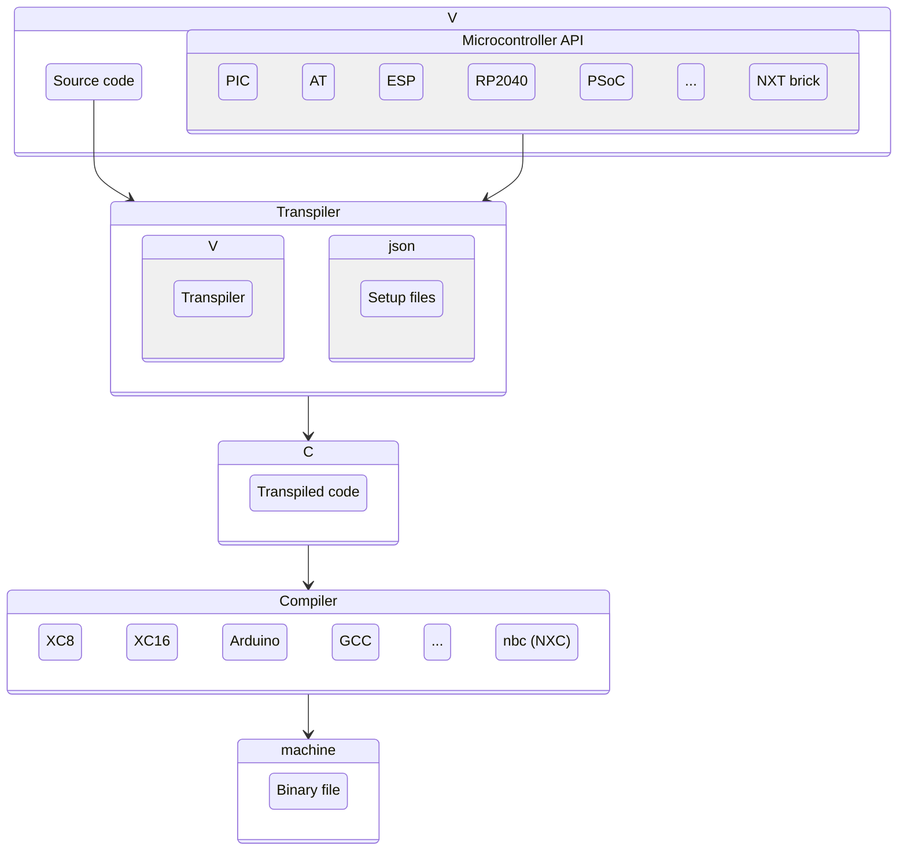

<div align="center">

<h1>V-based Programming Framework for Microcontrollers</h1>
</div>

Aixt is a programming framework for microcontrollers which implements a subset of the [_V_](https://vlang.io/) programming language, and is able to be used by low-resource devices. Aixt is composed by 3 main components:

- The **Aixt's V** programming language which is a subset of the original [_V language_](https://vlang.io/).
- The **V to C Transpiler**, which translate the **V** source code to _C_, for the specific _C_ compiler of each microcontroller.
- The **Aixt API** (almost all written in V), which makes the programming easy by standardizing the setup and I/O functions.

This diagram shows the Aixt blocks and their interactions:



Aixt is designed to be as modular as possible to facilitate the incorporation of new devices and boards. This is mainly possible by using a configuration files (in _json_ format) instead of creating new source code for each new device. That `.json` file contains the specific parameters of each device, board or compiler such as: variable types, initialization commands, compiler paths, etc.


## Aixt to C Transpiler

The transpiler is written in [_V_](https://vlang.io/) and uses the _V's_ self native compiler in order to transpile from _V_ to _C_. This is implemented in the folder `src\` and the main source code is the `src\aixt.v` file. **Aixt** generates code for 3 different backends:
- **c**: for the microcontroller native C compiler
- **nxc**: for the NXC compiler (LEGO Mindstorms NXT)
- **arduino**: for the Arduino CLI


## Aixt's V Language

**Aixt's V** programing language implements a subset of the [_V language_](https://vlang.io/). The main differences are show as follows:

feature                       | V                                       | Aixt's V
------------------------------|-----------------------------------------|-----------------------------------------------------------------
strings                       | dynamic-sized                           | dynamic-sized (only if supported)
arrays                        | dynamic-sized                           | dynamic-sized (only if supported)
default integers size         | 32 bits                                 | depends on the device
structs                       | allow functions (object-oriented)       | don't allow functions (only structured)
functions                     | multiple return values                  | only one return value
`C.functions()`               | need to be redefined in V               | can be called directly, only including the corespondent C header


### Example with `main` function

```v
/* Turning ON by 5.5 seconds the B7 on a
PIC16F84A microcontroller (XC8 compiler) */
import time
import pin

fn main() {
    pin.setup(b7, output)

    pin.high(b7)    //turn ON the LED on PORTB7
    time.sleep_ms(5500)
    pin.low(b7)
}
```

### Example without `main` function (Script mode)

```v
// ADC value to serial port on Raspberry Pi Pico (Arduino backend)
import time
import uart
import adc

uart.setup(9600)    // baud rate
adc.setup(12)       // resolution

for { // infinite loop
	analog := adc.read(adc0)
	uart.println('ADC channel 0: ${analog}') // use string interpolation
	time.sleep_ms(500)
}
```

## Aixt API

The **Aixt API** is inspired by _Micropython_, _Arduino_ and _Tinygo_. The API for all the ports includes at least functions for:

- Digital input/output
- Analog inputs (ADC)
- PWM outputs
- Serial port (UART)

## Using Aixt

### Installing Aixt from source
```
git clone https://github.com/fermarsan/aixt.git
cd aixt
make # make.bat on Windows
```

### Running Aixt
run it in a Linux-based system as:
```
./aixt <command> <device_or_board> <source_file>
```
or in Windows:
```
aixt.exe <command> <device_or_board> <source_file>
```

### Generating a Symbolic Link
For running the command `aixt` from any folder in the file system you can create a symbolic link of it in this way:

run it in a Linux-based system as:
```
./aixt symlink
```
or in Windows:
```
aixt.exe symlink
```

### Running examples:

```
./aixt -t Emulator test.v
```
```
./aixt -b NXT ports/NXT/projects/1_motor_forward.v
```

## Project's name

The project's name is inspired in _Veasel_, the Weasel pet of _V Language_, and at the same time is a tribute to _Ticuna_ people who live in the Amazon forest between the borders of _Colombia_, _Brasil_ and _Perú_. Weasels are _mustelids_ just like otters, so the name **Aixt** comes from _Aixtü_, which is a way to say otter in [_Ticuna_](https://www.sil.org/system/files/reapdata/90/20/51/90205190508691852389084667097660892450/tca_Ticuna_Dictionary_2016_web.pdf) language.

## Have questions?

Nice, you can contact me via mail.

Email: fmartinezsanta@gmail.com
<!-- Discord : https://discord.gg/-->

## Want to contribute?

Cool, go ahead and make the contributions you want, then submit a new pull request

The microcontroller or board that you use is not listed [here](docs/Devices%20and%20Boards.md) and you know how to program it in C?... You can easily add it to Aixt, please check [CONTRIBUTING.md](CONTRIBUTING.md).

Take a look at [TODO.md](TODO.md) to find a task for you.

Please check [CONTRIBUTING.md](CONTRIBUTING.md) to learn how you can contribute.


# License

The Aixt project is licensed under the [MIT](LICENSE), which is attached in this repository.
