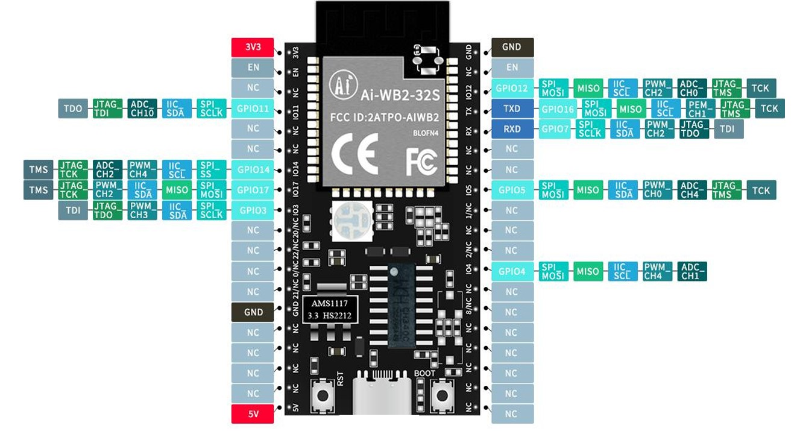

# **Fast guide AI-WB2-32S-KIT**
This Aixt implementation that supports the card  AI-WB2-32S-KIT

# **ID card AI-WB2-32S-KIT**

## View
* *Ai-WB2-32S-Kit, a total of 38 interfaces are connected, for example, the pin function definition table is the interface definition.*


*Image taken from the device datasheet*

## Datasheet
[AI-WB2-32S-KIT](http://www.ai-thinker.com/Uploads/file/20221008/20221008082356_37940.pdf)

## Port Identification
Below are the ports used and their proper designations for programming:

No.| Name     | Function 
-- |-----     |---
1  |3V3       |3.3V power supply; The output current of the external power supply is recommended to be above 500mA 
2  |EN        | By default, it is enabled as a chip, and the high level is effective 
3  |NC        | Empty feet 
4  |IO11      | GPIO11/SPI_SCLK/IIC_SDA/ADC_CH10/JTAG_TDI/TDO 
5  |NC        | Empty feet 
6  |Empty feet| Empty feet 
7  |IO14      | GPIO14/SPI_SS/IIC_SCL/PWM_CH4/ADC_CH2/JTAG_TCK/TMS 
8  |IO17      | GPIO17/SPI_MOSI/MISO/IIC_SDA/PWM_CH2/JTAG_TCK/TMS 
9  |IO3       | GPIO3/SPI_SCLK/IIC_SDA/PWM_CH3/JTAG_TDO/TDI 
10 |IO20/NC   | The default NC is unavailable 
11 |IO22/NC   | The default NC is unavailable 
12 |IO0/NC    | The default NC is unavailable 
13 |IO21/NC   | The default NC is unavailable 
14 |GND       | Ground 
15 |NC        | Empty feet 
16 |NC        | Empty feet 
17 |NC        | Empty feet 
18 |NC        | Empty feet 
19 |5V        | 5V power supply; External power supply output current is recommended to be above 500mA 
20 |NC        | Empty feet 
21 |NC        | Empty feet 
22 |NC        | Empty feet 
23 |NC        | Empty feet 
24 |NC        | Empty feet 
25 |IO8/NC    | The default NC is unavailable. 
26 |NC        | Empty feet 
27 |IO4       | GPIO4/SPI_MOSI/MISO/IIC_SCL/PWM_CH4/ADC_CH1 
28 |IO2/NC    | The default NC is unavailable
29 |NC        | Empty feet 
30 |IO1/NC    | The default NC is unavailable 
31 |IO5       | GPIO5/SPI_MOSI/MISO/IIC_SDA/PWM_CH0/ADC_CH4/JTAG_T MS/TCK 
32 |NC        | Empty feet 
33 |NC        | Empty feet 
34 |RX        | RXD/GPIO7/SPI_SCLK/IIC_SDA/PWM_CH2/JTAG_TDO/TDI 
35 |TX        | TXD/GPIO16/SPI_MOSI/MISO/IIC_SCL/PWM_CH1/JTAG_TMS/T CK 
36 |IO12      | GPIO12/SPI_MOSI/MISO/IIC_SCL/PWM_CH2/ADC_CH0/JTAG_T MS/TCK 
37 |NC        | Empty feet 
38 |GND       | Ground

## Programming in v language
For each of these modules, you will have a file in .c.v format with the same name of the module and in this you will have the text module followed by the name of the module, example:
* module pin
* module pwm
* module uart

### Output port configuration
To activate the port to use
```go
pin.setup(PIN_NAME, pin.out)
```
* *Example: If you want to activate the port 17;  `pin.setup(17, pin.out)`.*
To activate the port to use
```go
pin.high(PIN_NAME)
```
* *Example: If you want to activate the port 17;  `pin.high(17)`.*

To disable the port being used
```go
pin.low(PIN_NAME)
```
* *Example: If you want to disable the port 17;  `pin.low(17)`.*

To disable or enable the port to be used

```go
pin.write(PIN_NAME, VALUE)
```
* *Example: If you want to disable port 17 `pin.write(17, 1)`, and if you want to activate  `pin.write(17, 0)`.*

### Input port detection

If you need to know what state an entry port is in:
```go
x = pin.read(PIN_NAME)
```

* *Example: If you want to detect the VALUE of port 3; `x = pin.read(3)`, and `x` will take the VALUE of 0 or 1, depending on which port is active or disabled.*

### Pulse Width Modulation (PWM outputs)

To configure some PWM
```go
pin.setup(PIN_NAME, pin.out)
```
* *Example: in pwm you set the PWM to use `pin.setup(17, pin.out)`*


To configure the duty cycle of a modulator

Everything is implemented within a for, with a counter up to the desired cycles

```go
pwm.write(PIN_NAME, pin.out)
```
* *Example: in pwm you set the PWM to use* 
```go
for {
    pwm.write(17, val)
    sleep_ms(250)
    val=val+10
    if val==250{
		val=0  
    }
}
```

### Serial communication (UART)

The UART used to be the standard stream output, so the functions `print()`, `println()` and `input()` work directly on the default UART. The default UART could change depending on the board or microcontroller, please refer to the specific documentation. The syntax for most of UART functions is: `uart_function_name_x()`, being `x` the identifying number in case of multiple UARTs. You can omit the `x` for referring to the first or default UART, or in the case of having only one.  

### UART setup

For the UART module it is implemented as follows:
```v 
uart.setup(BAUD_RATE)
```
- `BAUD_RATE` configure the communication speed
* *Example: in uart to use `uart.setup(115200)`*
### Serial transmitting

```v
uart.print(MESSAGE)      // print a string to the default UART
```
* *Example: This is used as `uart.print(Uart for AIXT)`*
```v
uart.println(MESSAGE)    // print a string plus a line-new character to the default UART
```
* *Example: This is used as `uart.println(Command received)`*
```v
uart__ready // get everything ready for to UART
```
* *Example: This is used as `uart.ready()`*
```v
uart__read // receives binary data (in Bytes) to UART
```
* *Example: This is used as `uart.read()`*
```v
uart.write(MESSAGE)    // send binary data (in Bytes) to second UART
```
* *Example: This is used as `uart.write()`*

### Retardos

* Use of times

    * In each expression, the time VALUE is put inside the parentheses.
```go
time.sleep(S) //Seconds
```
* *Example: This is used as `time.sleep(2)`*
```go
time.sleep_ms(MS) //Milliseconds
```
* *Example: This is used as `time.sleep_ms(500)`*
```go
time.sleep_us(US) //Microseconds
```
 *Example: This is used as `time.sleep_us(5000)`*

## Implementation of the AIXT project

For the development of the program, some examples of the codes in v languages ​​are shown, which will be transpiled
* Example flashing LED

```go
import pin
import time {sleep_ms}

pin.setup(14, pin.out)

for {   //infinite loop
    pin.high(14)
    sleep_ms(500)
    pin.low(14)
    sleep_ms(500)
}
```
* Example PWM
```go
import time {sleep_ms}
import pin
import pwm

__global val = 0

pin.setup(17, pin.out)

for {
    pwm.write(17, val)
    sleep_ms(250)
    val=val+10
    if val==250{
		val=0  
    }
} 
```
* Example UART
```go
import time {sleep_ms}
import pin
import uart


  uart.setup(115200)
  pin.setup(4,pin.out)
  pin.setup(5,pin.out)
  pin.setup(12,pin.out)

for {
  uart.println_0("\r\n Este programa realiza unas funciones establecidas:")
  uart.println_0("\r\n Oprimiendo la letra A, activa la salida  del pin GPIO4.")
  uart.println_0("\r\n Oprimiendo la letra B, activa la salida  del pin GPIO5.")
  uart.println_0("\r\n El piloto (led) Rojo indica que esta esperando instrucciones.")
  uart.println_0("\r\n Esperando instrucciones: \r\n")

  pin.high(12)
  sleep_ms(500)

  pin.low(12)
  sleep_ms(500)
  x:=0
  x=uart.available()
  if  x> 0 {
  command := ` `
	command = uart.read_0()

    if command==`A` {
        uart.println_0("\r\n Comando A recibido. \r\n")
        uart.println_0("\r\n Realizando acción A. \r\n")
        pin.high(4)
        sleep_ms(5000)

        pin.low(4)
        sleep_ms(1000)
        uart.println_0("\r\n Proceso A finalizado. \r\n")
	}

      if command==`B` {
        uart.println_0("\r\n Comando B recibido. \r\n")
        uart.println_0("\r\n Realizando acción B. \r\n")
        pin.high(5)
        sleep_ms(5000)

        pin.low(5)
        sleep_ms(1000)
        uart.println_0("\r\n Proceso B finalizado. \r\n")
	  }

      else {
        pin.high(12)
        sleep_ms(1000)

        pin.low(12)
        sleep_ms(1000)
      
    }
  }
}
```
## Informative video
Informative video on the development of the AIXT project, with the device [Video-I-WB2-32S-KIT](https://youtu.be/BRSWZXQ2mLY)