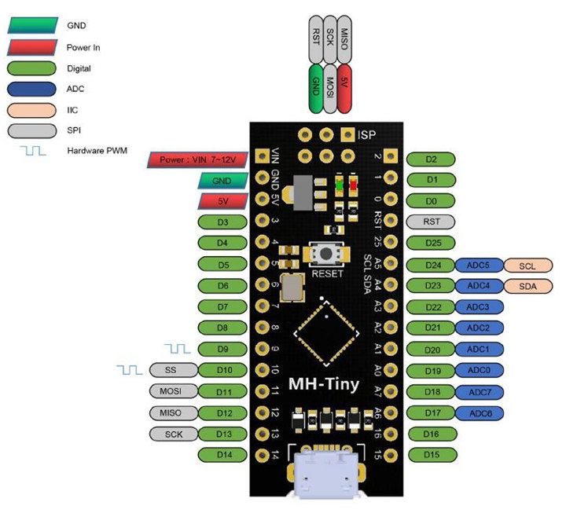

#                                                                    **QUICK GUIDE MH-ATTINY88**

Implementation of Aixt to support the MH-ATtiny88 card.

## SUMMARY 

* The ATtiny88 microcontroller is a small, high performance AVR microcontroller using a RISC processor. This microcontroller comes in two packages that are mainly used for interfacing and control between different sensors and devices.

* This microcontroller is available with low power consumption through MSSP and 10-bit ADC. The instruction code of this microcontroller can be stored through SRAM - 512 bytes and EEPROM - 64 bytes, manufactured by Micro Ship Tecnologic.

*  Device designed for embedded applications. It is based on the 8-bit AVR architecture and features a wide range of integrated peripherals, including GPIO ports, serial communication interfaces, timers and analog-to-digital converters. The MH-AT-tiny88 is suitable for a variety of applications, from basic control systems to portable devices and IoT sensors due to its combination of compact size, low power consumption and versatile functionality.

## THE FUNCTIONS:

* The ATtiny88 microcontroller performs several functions on a single integrated circuit. Some pins of the microcontroller are available with the ability to use the above function. Some of the main functions of this microcontroller include timers, SPI communication, I2C communication, BOD (Brown Out Reset), interrupt and ADC. This ATtiny88 microcontroller includes different memories such as FLASH, EEPROM and SRAM.
  
* The Atmel® ATtiny88 is a low-power 8-bit CMOS microcontroller based on the AVR® enhanced RISC architecture. By executing powerful instructions in a single clock cycle, the Atmel ATtiny88 achieves performances close to 1MIPS per MHz, allowing the system designer to optimize power consumption versus processing speed.


## FEATURES:
 

* Clock speed: 16Mhz (Number of cycles the CPU executes per second). 
* Power supply voltage: 5V via micro USB, 7-12V VIN pin. 
* 26 input/output pins (2 exclusively for USB).  
* 26 input/output pins for software PWM / 2 of them PWM (pulse width modulation) by hardware (D9-D10). 
* 8 analog inputs (Analog inputs are terminals or pins on a microcontroller that allow input of analog signals, a signal range of various values). 
* 12c and SPI interface (The Serial Communication Interface (SPI) and the Inter-Integrated Circuit (I2C) are two common serial communication protocols used in 
  electronics. Both protocols allow multiple devices to communicate with each other and with a microcontroller or processor). 
* PWR led and Builtin led or "Pin 0" test. 
* Reset button.  
* 8-bit AVR® microcontroller with high performance and low power consumption. 
* Speed range: 0 to 8Mhz at 2.7-5.5V, 0 to 16 Mhz at 4.5-5.5V.
* Low power consumption: active mode: 8Mhz at 5V-4.4mA, sleep mode: at 5V-6microA. 
* Advanced RISC architecture. 
* 123 powerful instructions - most execute in a single clock cycle. 
* 32 x 8 general-purpose working registers. 
* Fully static operation. 
* High endurance non-volatile memory segments. 
* 8K bytes of self-programmable flash program memory in the system (ATtiny88) refers to the storage capacity of the flash program memory in an electronic device. 
* 64 bytes of EEPROM (Electrically Erasable Programmable Read-Only Memory). 
* 512 bytes of internal SRAM (Static Random-Access Memory). 
* Write/erase cycles: 10,000 Flash/100,000 EEPROM. 
* Programming lock for software security. 
* Peripheral features. 
* One 8-bit timer/counter with independent prescaler and compare mode. 
* One 16-bit timer/counter with prescaler and compare and capture modes. 
* An 8-channel, 10-bit ADC in 32-terminal TQFP and 32-terminal QFN packages. 
* Serial SPI master/slave interface. 
* 2-wire byte-oriented serial interface (Phillips I2C compatible). 
* Programmable watchdog timer with independent on-chip oscillator. 
* On-chip analog comparator. 
* Interruption and activation by pin change.
* Special features of the microcontroller. 
* On-chip debugging system debugWIRE. 
* On-system programmable through SPI port. 
* Programmable power-on reset and brownout detection. 
* Internal calibrated oscillator. 
* External and internal interrupt sources. 
* Three sleep modes: Sleep, ADC noise reduction and shutdown. 
* I/O and packages. 
* 28 programmable I/O lines in 32-pin TQFP and 32-pin QFN package. 
* Operating voltage: 2.7- 5.5V. 
* Automotive temperature range: -40°C to +125°C. 

## CONFIGURATION OF PINS AND THEIR RESPECTIVE FUNCTIONS




Retrieved from: [ATtiny88 data sheet](https://ww1.microchip.com/downloads/en/DeviceDoc/atmel-9157-automotive-microcontrollers-attiny88_datasheet.pdf)

## DATA SHEET
[MH-ATtiny88](https://ww1.microchip.com/downloads/en/DeviceDoc/atmel-9157-automotive-microcontrollers-attiny88_datasheet.pdf)


## PIN IDENTIFICATION

Description of pins and their designation:

|PIN NO.  | NAME | FUNCTION |
|---------|--------|---------|
|0        |D0      |DIGITAL PIN, LED 0|
|1        |D1      |DIGITAL PIN|
|2        |D2      |DIGITAL PIN|
|3        |D3      |DIGITAL PIN|
|4        |D4      |DIGITAL PIN|
|5        |D5      |DIGITAL PIN|
|6        |D6      |DIGITAL PIN|
|7        |D7      |DIGITAL PIN|
|8        |D8      |DIGITAL PIN|
|9        |D9      |DIGITAL PIN|
|10       |D10     |DIGITAL PIN,SS|
|11       |D11     |DIGITAL PIN,MOSI|
|12       |D12     |DIGITAL PIN,MISO|
|13       |D13     |DIGITAL PIN,SCK|
|14       |D14     |DIGITAL PIN|
|15       |D15     |DIGITAL PIN|
|16       |D16     |DIGITAL PIN|
|17       |D17, A6  |DIGITAL PIN, analog-to-digital converter|
|18       |D18, A7  |DIGITAL PIN, analog-to-digital converter|
|19       |D19, A0  |DIGITAL PIN, analog-to-digital converter|
|20       |D20, A1  |DIGITAL PIN, analog-to-digital converter|
|21       |D21, A2  |DIGITAL PIN, analog-to-digital converter|
|22       |D22, A3  |DIGITAL PIN, analog-to-digital converter|
|23       |D23, A4  |DIGITAL PIN, analog-to-digital converter,SDA|
|24       |D24, A5  |DIGITAL PIN, analog-to-digital converter,SCL|
|25       |D25     |DIGITAL PIN|
|         |RST     |RESET|
|         |VIN     |POWER SUPPLY: VIN 7-12V|
|         |5V      |POWER SUPPLY: 5V|
|         |GND     | GROUND |


         
## ANALOG READOUT PORT CONFIGURATION

|PIN NO.  | NOMBRE | DECLARACION |
|---------|--------|-------------|
|17       |A6      | 1|
|18       |A7      | 2|
|19       |A0      |-5|
|20       |A1      |-4|
|21       |A2      |-3|
|22       |A3      |-2|
|23       |A4      |-1|
|24       |A5      | 0|

## PROGRAMMING LANGUAGE V


The descriptive functions contained in the API as inputs or outputs that perform analog-to-digital conversion:


NAME               | DESCRIPTION
------------------------|------------------------------
`pin.setup(pin, mode)`    | Configure pin like `mode (input, out)`
`pin.high(pin)`           | Digital output on `high pin`
`pin.low(pin)`           | Digital output on `low pin`
`pin.write(pin, val)`     | Type val in `pin`
`pin.read(pin)`           | Digital input `pin`
`adc.read(pin)`           | Analog pin readout for adc
`pwm.write(pin, val)`     | Output pin and a useful val cycle
`uart.setup(baund_rate)`  | Initiation Serial Communication to Baund_rate
`uart.read()`             | Serial Communication Reading
`println(message)`        | Print message via Serial Communication
`time.sleep(time)`             | delay in `S`
`time.sleep_us(time)`          | delay in `uS`
`time.sleep_ms(time)`          | delay in `mS`
`pin.input`    | Parameter `mode` input configuration 
`pin.output`    | Parameter `mode` output configuration 
`uart.any()` |	Get the number of bytes to read


* The following table will present equivalences between the native functions of the compiler in contrast to those implemented in the Aixt project, with the central idea being to redefine these functions and offer standardized support.


DEFINITION AIXT	 | DEFINITION ARDUINO
-----------------|-----------------------------
`adc__read(PIN_NAME)`|    	`analogRead(PIN_NAME)`
`pin__high(PIN_NAME)`| 		`digitalWrite(PIN_NAME, HIGH)`
`pin__low(PIN_NAME)`|        	`digitalWrite(PIN_NAME, LOW)`
`pin__output`| 				`OUTPUT`
`pin__input`|	`INPUT`
`pin__input_pullup	INPUT_PULLUP`|
`pin__read(PIN_NAME)`|   	`digitalRead(PIN_NAME)`
`pin__setup(PIN_NAME, MODE)`|        	`pinMode(PIN_NAME, MODE)`
`pin__write(PIN_NAME, VALUE)`|  	`digitalWrite(PIN_NAME, VALUE)`
`pwm__write(PIN, VALUE)`|   	`analogWrite(PIN, VALUE)`
`time__sleep_ms(MS)`|  	`delay(MS)`
`time__sleep_us(US) `|  	`delayMicroseconds(US)`
`time__sleep(S)`|	`delay(S*1000)`
`uart__any_0()`|		`Serial.available()`
`uart__any_1()`|		`Serial1.available()`
`uart__any_x(UART_NUMBER)	uart__any ## UART_NUMBER ##`| `serial.available()`
`uart__print_0(MESSAGE)`|		`Serial.print(MESSAGE)`
`uart__print_1(MESSAGE)`|		`Serial1.print(MESSAGE)`
`uart__println_0(MESSAGE)`|		`Serial.println(MESSAGE)`
`uart__println_1(MESSAGE)`|		`Serial1.println(MESSAGE)`
`uart__read_0()`|		`Serial.read()`
`uart__read_1()`|		`Serial1.read()`
`uart__setup(BAUD_RATE)`|   	`Serial.begin(BAUD_RATE)`
  `  *Table of equivalences between functions`


## CODE SAMPLES

Addition of V language examples which can be implemented in the Aixt project for testing and translation:

### BLINK OF LED

Flashing of one LED in an infinite cycle with time delay:

```go
import time { sleep_ms }  			// import the time module from the API
import pin				        // import the pin module from the API

pin.setup(1, pin.output)  			// configures pin number 1 as output 

for {                     			//main loop of the code 
	pin.high(1)			        //pin high
	sleep_ms(500)	  	      		//delay in seconds 
	pin.low(1)			        //pin low
	sleep_ms(500)		       		 //delay in seconds
}
```
### DIGITAL READOUT

Example of digital readout, led sequence:

```go
import time {sleep_ms}        			  // import the sleep_ms function of the time module 
import pin 			               	 // Import the pin module in its entirety

pin.setup(14, pin.output)    	// Set pin #14 as output
pin.setup(15, pin.output)    	// Set pin #15 as output
pin.setup(16, pin.output)    	// Set pin #16 as output

for{
    pin.high(14)  		  // output 14 high   
    sleep_ms(2000) 		  // delay of 2000 ms
    pin.low(14)   		  // output 14 low
    pin.high(15)     		  // output 15 high
    sleep_ms(2000) 		  // delay of 2000 ms 	
    pin.low(15)   	  	  // output 15 low
    pin.high(16)     		  // output 16 high 
    sleep_ms(2000)   		  // retardo de 2000 ms
    pin.low(16) 		  // output 15 baja
}
```
### ANALOG AND DIGITAL READOUT

In this example we will test the analog and digital readings through the flashing of a LED that depends on the variation of a variable resistor:
```go
import pin                            // Import the pin module in its entirety
import adc                            // Import the adc module in its entirety
import pwm                            // Import the pwm module in its entirety

__global (
    brillo = 0                        // crea una variable global
    )
   


for{                                    // creates the cycle
  brillo=adc.read(-5)                    //read digital anologa entry
    pwm.write(3,brillo)                   //write the pwm output
}

```


### SERIAL COMMUNICATION

Test UART communication with counter increasing if switch is pressed:

```go

import pin             //import the module pin from API
import uart            //import the module uart from API
  
__global(
button:=0              //defined global variable initialized to 0
        )


for {                   //for loop that executes the main code

	if pin.read(3) == 1  
	{ 
		button=button+1 
		uart.print(button)
	}
}
```


* Next you can see an explanatory video of transcompilation or translation from the Aixt project, this video is about the pulse width modulation or PWM test, where the luminous flux of a LED light emitting diode is varied, by means of the variation of a variable resistor or potentiometer. The pins are read and written with analog-digital function.

 Link Youtube : [ATtiny88 test PWM-ADC](https://youtu.be/aViNecpmvjw)
