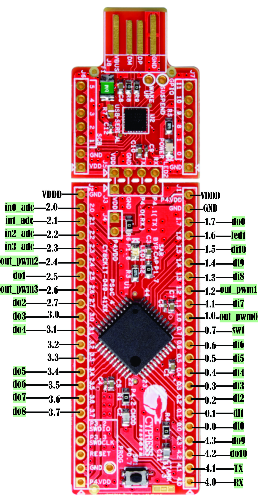

# Guía rápida PSoC4
Esta implementación de Aixt para PSoC 4 da soporte a la tarjeta   CY8CKIT-049-42XX; 


# Identificación tarjeta CY8CKIT-049-42XX

## Vista


## Hoja de datos
[CY8CKIT-049-42XX](https://www.infineon.com/dgdl/Infineon-CY8CKIT-049-4xxx_PSoC_4_Prototyping_Kit_Guide-UserManual-v01_00-EN.pdf?fileId=8ac78c8c7d0d8da4017d0ef17bd002cb)


# Configuración general

Se integran las funciones básicas del microcontrolados para generar una estructura hardware general, asi;

- 4 pwms
- 1 leds
- 1 pulsador
- 2 puertos de comunicación
- 11 entradas digitales
- 11 salidas digitales
- 4 entradas análogas

*visualización en PSoC creator*

](Imagenes/CY8CKIT04942XX/Estructura_general_hardware_4942.jpg)

## Identificación de puertos
A continuación se muestran los puertos que se usan y sus debidos nombramientos para la programación: 

Puerto | nombre |Tipo    |
--  |-       |-       |
1.6 |led1    |salida
0.7 |sw1     |entrada 
0.0 |di0     |entrada 
0.1 |di1     |entrada
0.2 |di2     |entrada
0.3 |di3     |entrada
0.4 |di4     |entrada
0.5 |di5     |entrada
0.6 |di6     |entrada
1.1 |di7     |entrada
1.3 |di8     |entrada
1.4 |di9     |entrada
1.5 |di10    |entrada
1.7 |do0     |salida 
2.5 |do1     |salida
2.7 |do2     |salida
3.0 |do3     |salida
3.1 |do4     |salida
3.4 |do5     |salida
3.5 |do6     |salida
3.6 |do7     |salida
3.7 |do8     |salida
4.2 |do9     |salida
4.3 |do10    |salida
1.0 |out_pwm0|salida
1.2 |out_pwm1|salida
2.4 |out_pwm2|salida
2.6 |out_pwm3|salida
2.0 |in0_adc |entrada
2.1 |in1_adc  |entrada
2.2 |in2_adc  |entrada
2.3 |in3_adc |entrada
4.0 |\uart:rx\ |salida
4.1 |\uart:tx\ |salida

## Programación en lenguaje v

### Configuración puertos de salida

Para activar el puerto que va ha usar;
```v
pin.high(pin_name)
```
*Ejemplo: Si se desea activar el puerto do0;  `pin.high(pin.do0)`.*

Para desactivar el puerto que se está usando;
```v
pin.low(pin_name)
```
*Ejemplo: Si se desea desactivar el puerto do0;  `pin.low(pin.do0)`.*

Para desactivar o activar el puerto que se va ha usar;

```v
pin.write(pin_name, value)
```
*Ejemplo: Si se desea desactivar el puerto do0;  `pin.write(do0, 1)`, y si se desea activar;  `pin.write(pin.do0, 0)`.*

### Detección puertos de entrada

Si se necesita saber en que estado esta un puerto de entrada:
```v
x = pin.read(pin_name)
```

*Ejemplo: Si se desea detectar el valor del puerto di0; `x = pin.read(pin.di0)`, y x tomara el valor de 0 o 1, dependiendo el puerto es activo o desactivado.*

### Puertos análogos a digital (ADC)

Para configurar uno de los puertos análogos;
```v
adc.setup(channel, setup_value_1, ... )
```
*En channel se introduce el nombre del puerto análogo, en setup_value_1 el valor que se le va ha dar ha dicho puerto.*

Para detectar el valor del puerto análogo;
```v
x = adc.read(channel)
```
*En channel se introduce el nombre del puerto análogo, y x toma el valor que tenga dicho puerto.*

### PWM

Para configurar algún pwm;
```v
pwm.setup(pwm_id, setup_value_1, ... )
```
*En pwm_id se pone el pwm a usar,  y en setup_value_1 el valor al cual se desea configurar dicho pwm.*


Ahor, para configurar el ciclo de trabajo de un modulador;
```v
pwm_duty(pwm_id, duty)
```
*En pwm_id se pone el pwm a usar,  y en duty el valor del ciclo (de 0 a 100) en porcentaje.*

### Serial comunication (UART)

Para configurar un puerto UART;
```v
uart.setup(uart_id, baud_rate)
```
*Aquí uart_id es el nombre del puerto que se va ha usar, y baud_rate es el valor de los baudios al cual se va ha usar.*

Si se requiere ingresar un valor a un puerto UART;
```v
x = uart.input(uart_id)
```
*Donde x es dicho valor.*

En el caso de que se necesite tomar un valor del puerto UART que se esta usando;

-Forma lineal
```v
uart.println(uart_id, message)
```
*Muestra el mensaje (message) de tal forma que un carácter sigue al otro.*

-Forma no lineal
```v
uart.print(uart_id, message)
```
*Muestra el mensaje (message) con saltos de renglon.*

### Retardos

Uso de tiempos;

-Segundos
```v
time.sleep(s)
```
-milisegundos

```v
time.sleep_ms(ms)
```


-Microsegundos

```v
time.sleep_us(us)
```
*En cada expresión, el valor del tiempo se pone dentro del parentesis.*

Ejemplo LED parapadeante

```v
import machine { pin }
import time { sleep_ms }

pin_mode(led1, out)

for {   //infinite loop
    pin.high(led1)
    sleep_ms(500)
    pin.low(led1)
    sleep_ms(500)
}
```