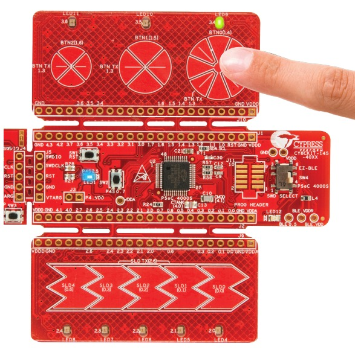

# Quick Guide PSoC4

This Aixt implementation for PSoC 4 supports the CY8CKIT14540XX board.

# This Aixt implementation for PSoC 4 supports the CY8CKIT14540XX board.

## View


## Datasheet
[Datasheet CY8CKIT14540XX](https://www.infineon.com/dgdl/Infineon-CY8CKIT-145-40XX_PSoC_4000S_Prototyping_Kit_Guide-UserManual-v01_00-EN.pdf?fileId=8ac78c8c7d0d8da4017d0efccdd91344)


# General Configuration

The basic microcontroller functions are integrated to generate a general hardware structure, as follows:

- 3 PWMs
- 9 LEDs
- 1 push button
- 2 communication ports (UARTs)
- 3 digital inputs
- 3 digital outputs
- 5 capacitive slider sensors
- 3 capacitive button sensors

*Visualization in PSoC Creator*


## Port Identification

The following table shows the ports used and their assigned names for programming: 

| Port | name      | Type   |
| ---- | --------- | ------ |
| 2.5  | led1      | output |
| 2.0  | led4      | output |
| 2.1  | led5      | output |
| 2.2  | led6      | output |
| 2.3  | led7      | output |
| 2.4  | led8      | output |
| 3.4  | led9      | output |
| 3.5  | led10     | output |
| 3.6  | led11     | output |
| 0.7  | sw2       | input  |
| 2.7  | di0       | input  |
| 0.4  | di1       | input  |
| 1.7  | di2       | input  |
| 4.0  | do0       | output |
| 0.5  | do1       | output |
| 3.7  | do2       | output |
| 1.2  | out_pwm0  | output |
| 2.6  | out_pwm1  | output |
| 1.0  | out_pwm2  | output |
| 3.0  | \uart:rx\ | output |
| 3.1  | \uart:tx\ | output |
| 0.0  | sld0      | input  |
| 0.1  | sld1      | input  |
| 0.2  | sld2      | input  |
| 0.3  | sld3      | input  |
| 0.6  | sld4      | input  |
| 1.4  | btn0      | input  |
| 1.5  | btn1      | input  |
| 1.6  | btn2      | input  |

## Programming in V language

For each of these modules, you will have a file in .c.v format with the same name of the module and in this you will have the text module followed by the name of the module, example:

* module pin
* module pwm
* module uart
* module adc

An important feature of this board is the LED activation: LEDs turn on with logical zeroes, as shown in the LEDs corresponding to the capacitive slider sensors:



### Output port configuration

To activate an output port;
```v
pin.high(pin_name)
```
*Example: to activate the output port called led1; ` pin.high(led1)`*

To deactivate an output port;
```v
pin.low(pin_name)
```
*Example: to deactivate the output port called led1; `pin.low(led1)`*

To activate or deactivate an output port;

```v
pin.write(pin_name, value)
```
*Example: to deactivate led1;  `pin.write(led1, 1)`, and to activate it;  `pin.write(led1, 0)`.*

### Input Port Detection

To check the state of an input port:
```v
x = pin.read(pin_name)
```

*Example: to detect the value of port sw2;  `x = pin.read(sw2) `, The variable x will take a value of 0 or 1 depending on whether the port is active or inactive*

### PWM

To configure PWM on one of the ports;
```v
pwm.write(pwm.channel,duty)
```
*pwm.channel indicates the channel to control, and duty represents the duty cycle value (from 0 to 10000).*

*Example: to control channel 1 with a PWM signal with duty cycle = 10000, `pwm.write(pwm.ch1, 10000) `*


### Serial comunication (UART)

To configure a UART communication port;

```v

uart.setup(), // Initializes and configures the UART with basic parameters

```
## Serial Transmission

*Since the port is already defined as "uart:tx", this is the only available serial UART communication port. The value you place in "message" will be the data transmitted*

```v

uart.print(message) // Prints text (string or number converted to characters) and sends it to the UART TX register
```

```v

uart.println(message) // Prints text and appends a newline (\r\n)

```

```v

uart.read() // Receives data from the UART port (reads input on RX pin)

```

```v

uart.write() // Sends data through the UART port (writes directly to TX register)

```

### Analog-to-Digital Converter (ADC)

To initialize and configure the ADC module

```v

adc.setup()

```

To read the digital value converted by the ADC on a specific channel.

```v

adc.read()

```


### Delays

Using time functions;

* Seconds
```v
time.sleep(s)
```

* Milliseconds

```v
time.sleep_ms(ms)
```

* Microseconds

```v
time.sleep_us(us)
```

*In each expression, place the desired time value inside the parentheses*

* Example: Blinking LED (high/low functions)

```v

import time {sleep_ms}
import pin


for {
	pin.high(led1)
	time.sleep_ms(5000)
	pin.low(led1)
	time.sleep_ms(5000)
}

```
* Example: Blinking LED (write function)

```v
import time
import pin

for {
	pin.write(led_1, 0)
	time.sleep_ms(500)
	pin.write(led_1, 1)
	time.sleep_ms(500)
}

```
* Example: LED controlled by button (read function)

```v

import time {sleep_ms}
import pin


for {

    if pin.read(sw2) == 1 {     // If the button is pressed (logic high)
        pin.high(led1)           // Turn LED on
    } else {
        pin.low(led1)            // Turn LED off
    }

    time.sleep_ms(100)             // Small delay to avoid bouncing
}

```

* PWM example 

```v

import time {sleep_ms}
import pwm

for {
    pwm.write(pwm.ch1, 10000)
    sleep_ms(500)

    pwm.write(pwm.ch1, 5000)
    sleep_ms(500)

    pwm.write(pwm.ch1, 0)
    sleep_ms(500)
    
 }
 
  ```


* UART example 

```v

import time {sleep_ms}
import uart

uart.setup()
for {

uart.print("Sending for UART...\r\n")
time.sleep_ms(1000) 

}

```

* ADC example 

```v

import time
import uart
import adc

uart.setup()

for {
	analog := adc.read(adc.ch0)
	uart.println('ADC channel 0: ${analog}')
	time.sleep_ms(1000)
}

```