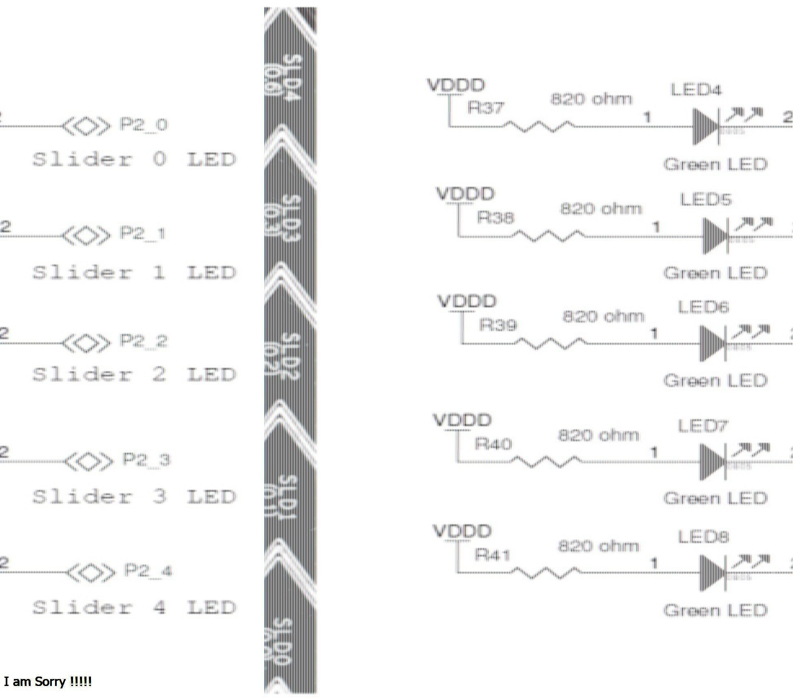

# Guía rápida PSoC4
Esta implementación de Aixt para PSoC 4 da soporte a la tarjeta   CY8CKIT14540XX

# Identificación tarjeta CY8CKIT14540XX	

## Vista


## Hoja de datos
[CY8CKIT14540XX](https://www.infineon.com/dgdl/Infineon-CY8CKIT-145-40XX_PSoC_4000S_Prototyping_Kit_Guide-UserManual-v01_00-EN.pdf?fileId=8ac78c8c7d0d8da4017d0efccdd91344)


# Configuración general

Se integran las funciones básicas del microcontrolados para generar una estructura hardware general, asi;

- 3 pwms
- 9 leds
- 1 pulsador
- 2 puertos de comunicación
- 3 entradas digitales
- 3 salidas digitales
- 5 sensores capacitivos tipo slider
- 3 sensores capacitivos tipo boton

*visualización en PSoC creator*

](Imagenes/CY8CKIT14540XX/Estructura_general_hardware_14540.jpg)

## Identificación de puertos
A continuación se muestran los puertos que se usan y sus debidos nombramientos para la programación: 

Puerto | nombre |Tipo    |
--  |-       |-       |
2.5 |led1    |salida
2.0 |led4    |salida
2.1 |led5    |salida
2.2 |led6    |salida
2.3 |led7    |salida
2.4 |led8    |salida
3.4 |led9    |salida
3.5 |led10   |salida
3.6 |led11   |salida
0.7 |sw2     |entrada
2.7 |di0     |entrada
0.4 |di1     |entrada
1.7 |di2     |entrada
4.0 |do0     |salida
0.5 |do1     |salida
3.7 |do2     |salida
1.2 |out_pwm0|salida
2.6 |out_pwm1|salida
1.0 |out_pwm2|salida
3.0 |\uart:rx\ |salida
3.1 |\uart:tx\ |salida
0.0 |SLD0     |entrada
0.1 |SLD1     |entrada
0.2 |SLD2     |entrada
0.3 |SLD3     |entrada
0.6 |SLD4     |entrada
1.4 |BTN0     |entrada
1.5 |BTN1     |entrada
1.6 |BTN2     |entrada

## Programación en lenguaje v

Algo importante en esta tarjeta es la activación de los leds, estos se encienden con ceros logicos, como se puede apreciar en los leds correspondientes a los sensores capacitivos tipo slider:



### Pin output

Para activar el puerto que va ha usar;
```go
pin.high(pin_name)
```
*Ejemplo: si se desea activar el puerto do0; ` pin.high(do0)`.*

Para desactivar el puerto que se está usando;
```go
pin.low(pin_name)
```
*Ejemplo: si se desea desactivar el puerto do0; `pin.low(do0)`.*

Para desactivar o activar el puerto que se va ha usar;

```go
pin.write(pin_name, value)
```
*Ejemplo: si se desea desactivar el puerto do0;  `pin.write(do0, 1)`, y si se desea activar;  `pin.write(do0, 0)`.*

### Detección puertos de entrada

Si se necesita saber en que estado esta un puerto de entrada:
```go
x = pin.read(pin_name)
```

*Ejemplo: Si se desea detectar el valor del puerto di0;  `x = pin.read(di0)`, y x tomara el valor de 0 o 1, dependiendo el puerto es activo o desactivado.*

### PWM

Para configurar algún pwm;
```go
pwm.setup(pwm_id, setup_value_1, ... )
```
*En pwm_id se pone el pwm a usar,  y en setup_value_1 el valor al cual se desea configurar dicho pwm.*


Ahora, para configurar el ciclo de trabajo de un modulador;
```go
pwm_duty(pwm_id, duty)
```
*En pwm_id se pone el pwm a usar,  y en duty el valor del ciclo (de 0 a 100) en porcentaje.*

### Serial comunication (UART)

Para configurar un puerto UART;
```go
uart.setup(uart_id, baud_rate)
```
*Aquí uart_id es el nombre del puerto que se va ha usar, y baud_rate es el valor de los baudios al cual se va ha usar.*

Si se requiere ingresar un valor a un puerto UART;
```go
x = uart.input(uart_id)
```
*Donde x es dicho valor.*

En el caso de que se necesite tomar un valor del puerto UART que se esta usando;

-Forma lineal
```go
uart.println(uart_id, message)
```
*Muestra el mensaje (message) de tal forma que un carácter sigue al otro.*

-Forma no lineal
```go
uart.print(uart_id, message)
```
*Muestra el mensaje (message) con saltos de renglon.*

### Retardos

Uso de tiempos;

-Segundos
```go
sleep(s)
```
-milisegundos

```go
sleep_ms(ms)
```


-Microsegundos

```go
sleep_us(us)
```
*En cada expresión, el valor del tiempo se pone dentro del parentesis.*

Ejemplo LED parapadeante

```go
import machine { pin }
import time { sleep_ms }

pin_mode(led1, out)

for {   //infinite loop
    pin.high(led1)
    sleep_ms(500)
    pin.low(led1)
    sleep_ms(500)
}
```