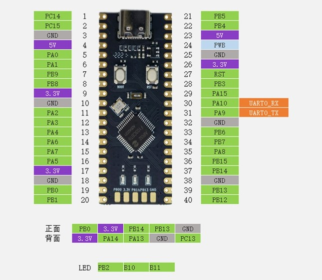

# **Fast guide STM32F103C*
This Aixt implementation that supports the card  Blue Pill STM32F103C

# **ID card STM32F103C**

## View
* *AIR32F103C, a total of 44 interfaces are connected, for example, the pin function definition table is the interface definition.*


*Image taken from the device datasheet*

## Datasheet
[AIR32F103C](https://wiki.luatos.org/chips/air32f103/mcu.html)
To program the card STM32F103C, the ST must be connected,therefore, it is recommended to see the datasheet:
[ST LINK-V2](https://www.waveshare.com/wiki/ST-LINK/V2_(mini))

## Port Identification
Below are the ports used and their proper designations for programming:

No.| Name     | Function 
-- |-----     |---
1  |PC14      |OSC32_IN
2  |PC15      |OSC32_OUT              
3  |GND       | GROUND CARD BLUE PILL AIR32F103C
4  |5V        | INPUT 5V BLUE PILL AIR32F103C
5  |PA0       | WKUP/USART2_CTS/ADC12_IN0/TIM2_CH1_ETR/TIM5_CH1
6  |PA1       | USART2_RTS/ADC12_IN1/TIM2_CH2/TIM5_CH2
7  |PB9       | PWM
8  |PB8       | TIM4_CH
9  |3.3V      | INPUT 3.3V BLUE PILL AIR32F103C 
10 |GND       | GROUND CARD BLUE PILL AIR32F103C
11 |PA2       | USART2_TX/ADC12_IN2/TIM2_CH3/TIM5_CH3
12 |PA3       | USART2_RX/ADC12_IN3/TIM2_CH4/TIM5_CH4
13 |PA4       | SPI1_NSS/USART2_CK/DAC_OUT1/ADC12_IN4
14 |PA6       | SPI1_MISO/ADC12_IN6/
15 |PA7       | SPI1_MOSI/ADC12_IN7/TIM3_CH2
16 |PA5       | SPI1_SCK/ADC12_IN5/DAC_OUT2
17 |3.3V      | INPUT 3.3V BLUE PILL AIR32F103C 
18 |GND       | GROUND CARD BLUE PILL AIR32F103C
19 |PB0       | ADC12_IN8/TIM3_CH3
20 |PB1       | ADC12_IN9/TIM3_CH4
21 |PB5       | I2C1_SMBA/SPI3_MOS
22 |PB4       | SPI3_MIS
23 |5V        | INPUT 5V BLUE PILL AIR32F103C
24 |PWB       |         
25 |GND       | GROUND CARD BLUE PILL AIR32F103C
26 |3.3V      | INPUT 3.3V BLUE PILL AIR32F103C 
27 |RST       | OUTPUT RESET 
28 |PB3       | SPI3_SCK
29 |PA15      | SPI3_NS
30 |PA10      | UART 0_RX


31 |PA9       | UART 0_TX
32 |GND       | GROUND CARD BLUE PILL AIR32F103C
33 |PB6       | I2C1_SCL/TIM4_CH
34 |PB7       | I2C1_SDA/TIM4_CH
35 |PA8       | USART1_CK/TIM1_CH1/MCO
36 |PB15      | SPI2_MOSI/TIM1_CH3N 
37 |PB14      | SPI2_MISO/USART3_RTS/TIM1_CH2N
38 |GND       | GROUND CARD BLUE PILL AIR32F103C
39 |PB13      | SPI2_SCK/USART3_CTS/TIM1_CH1N
40 |PB12      | SPI2_NSS/I2C2_SMBA/USART3_CK/TIM1_BKIN
3.3V          | ELECTRICAL POWER SUPPLY 3.3V BLUE PILL AIR32F103C
PB14          | ISPI2_MISO/USART3_RTS/TIM1_CH2N
PB13          | ISPI2_MISO/USART3_RTS/TIM1_CH1N
GND           | GROUND CONNECTOR ST-LINK V2
PC13          | TAMPER-RTC
GND           | GROUND CONNECTOR ST-LINK V2
SWDIO|PA13    |
SWCLK|PA14    |
3.3V          | ELECTRICAL POWER SUPPLY 3.3V BLUE PILL AIR32F103C
PB2           | LED 1 AZUL
PB10          | LED 2 VERDE
PB11          | LED 3 ROJO


## Digital input and output
To recognize the digital inputs and outputs, the input and output ports of the card are tested respectively. For this, a code is programmed which allows the ports identified in it to be tested one by one (scheme 2). such as: A0,A1,A2,A3,A4,A5,A6,A7,B0,B1,B8,B9, the aforementioned can also be used as outputs since the card pins allow both functions according to how they are cataloged in programming, the difference between these ports or pins will be that some support voltages of exactly 5 volts and others that support voltages lower than 5 volts, for this type of pins that did not support voltages that reached 5 volts, they were tested with a voltage of 3.3 volts, in order to deliver the 3.3 volts and 5 volts to the card, a ST-LINK V2 burner is used which allows us to select between these two voltages which one we want to deliver and allows us to synchronize the program that we have on the card. ARDUINO IDE application 2.2.1 STM32VLD to FLASH board and AIR32F103C board.

## Analog input and output
To determine which are the analog inputs, the same port testing process carried out previously is carried out with the difference that only the ports that allow them to be used to receive and transmit analog signals will be tested, which allow the amplitude and period of the signal to be modified. A signal for this case is reflected when a potentiometer is used, which works as a variable resistor that has a value between 0Ω and 10 kΩ that regulates the level of voltage that will be supplied by this device at the input of our LED. , the LED is protected by a 330Ω resistor, with this circuit which will allow us to observe how the luminous intensity of the LED varies depending on the value of Ω assigned to the potentiometer, during the verification it is obtained that the ports that allow the transfer Analog signals for our AIR32F103C card are A8, A9, A10,B3,B4,B5,B6,B7,B12, B13,B14,B15

## Signal PWM 
To identify the PWM signal port of the AIR32F103 card, the ports of the card are tested to find out which of them provides us with this function, so we can obtain a PWM signal using an analog signal as input modulating the width of the pulses generated by the output ports through, during identification it is obtained that the pins that allow the emission of a PWM signal are A6, A7,A8,A9,A10, B1, B4,B6,B7,B9, for this purpose the programming of a code which allowed the ports identified above to be recognized one by one and which can be seen in (scheme 2).

## UART communication
To establish the ports of the card that allow us to have UART communication, the 3.3 V provided by the AIR32F103 card is used as input, the input voltage is regulated by means of a potentiometer that, by turning its knob and through communication between The cards through the UART port allow LEDs assigned on the STM32F103C card to be turned on and off, when our voltage regulation device is at its minimum resistance value the green LED must be on, when it reaches the average resistance value it must turn on the yellow LED and when it reaches its maximum resistance value the Red LED at the input must turn on, an LED must be connected to each port, to do this these two cards will be connected through the generic UART port, that is, connect the PA9 port (TX) of the AIR32F103C card with port PA10 (RX) of the STM32F103C card and port PA10 (RX) of the AIR32F103C card with port PA9 (TX) of the STM32F103C card.

## Programming in v language
For each of these modules, you will have a file in .c.v format with the same name of the module and in this you will have the text module followed by the name of the module, example:
* module pin
* module adc
* module pwm
* module uart


### Output port configuration
To activate the port to use
```go
pin__setup(PIN_NAME, MODE)
```
To activate the port to use
```go
pin__high(PIN_NAME)
```
* *Example: If you want to activate the port 17;  `pin__high(17)`.*

To disable the port being used
```go
pin__low(PIN_NAME)
```
* *Example: If you want to disable the port 17;  `pin__low(17)`.*

To disable or enable the port to be used

```go
pin__write(PIN_NAME, VALUE)
```
* *Example: If you want to disable port 17 `pin__write(17, 1)`, and if you want to activate  `pin__write(17, 0)`.*

### Input port detection

If you need to know what state an entry port is in:
```go
x = pin__read(PIN_NAME)
```

* *Example: If you want to detect the VALUE of port 3; `x = pin__read(17)`, and `x` will take the VALUE of 0 or 1, depending on which port is active or disabled.*

### Analog to digital ports (ADC)

To configure one of the analog ports
```go
adc__setup(PIN_NAME, SETUP_VALUE, ... )
```
* *In PIN_NAME the name of the analog port is entered, in SETUP_VALUE the VALUE that will be given is said port.*

To detect the analog port VALUE
```go
x = adc__read(PIN_NAME)
```
* *In `PIN_NAME` the name of the analog port is entered, and `x` takes the VALUE of said port..*

## Pulse Width Modulation (PWM outputs)

To configure some PWM
```go
pwm__setup(SETUP_VALUE, setup_VALUE_1, ... )
```
* *In pwm you set the PWM to use, and in SETUP_VALUE the VALUE to which you want to configure said pwm.*


To configure the duty cycle of a modulator
```go
pwm__duty(duty)
```
* *In PWM the pwm to be used is set, and in `duty` the VALUE of the cycle (from 0 to 100) in percentage.*

## Serial communication (UART)

The UART used to be the standard stream output, so the functions `print()`, `println()` and `input()` work directly on the default UART. The default UART could change depending on the board or microcontroller, please refer to the specific documentation. The syntax for most of UART functions is: `uart_function_name_x()`, being `x` the identifying number in case of multiple UARTs. You can omit the `x` for referring to the first or default UART, or in the case of having only one.  

### UART setup

```v
uart__setup(BAUD_RATE)   // the same of uart__setup(BAUD_RATE)
```
For a second connection it is used as:
```v 
uart__setup_1(BAUD_RATE)   // the same of uart__setup_1(BAUD_RATE)
```
- `BAUD_RATE` configure the communication speed
### Serial transmitting

```v
uart__print(MESSAGE)      // print a string to the default UART
```
```v
uart__println(MESSAGE)    // print a string plus a line-new character to the default UART
```
```v
uart__ready // get everything ready for to UART
```
```v
uart__read // receives binary data (in Bytes) to UART
```
```v
uart__write(MESSAGE)    // send binary data (in Bytes) to second UART
```
- For a second UART, it would be used as follows:
```v
uart__print_1(MESSAGE)    // print a string to the second UART
```
```v
uart__println_1(MESSAGE)  // print a string plus a line-new character to the second UART
```
```v
uart__write_1(MESSAGE)    // send binary data (in Bytes) to second UART
```
```v
uart__ready_1 // get everything ready for to second UART
```
```v
uart__read_1 // receives binary data (in Bytes) to second UART
```

### Retardos

* Use of times

    * In each expression, the time VALUE is put inside the parentheses.
```go
time__sleep(S) //Seconds
```
```go
time__sleep_ms(MS) //Milliseconds
```
```go
time__sleep_us(US) //Microseconds
```

* Example flashing LED

```go
import pin
import time {sleep_ms}

pin.setup(14, pin.out)

for {   //infinite loop
    pin.high(14)
    sleep_ms(500)
    pin.low(14)
    sleep_ms(500)
}
```

* Example digital input and output
```go
const int ledPIN1 = PA3; //salida digital al led PA3

const int intPIN = PA0; //entrada digital al led PA0
void setup() {
     Serial.begin(9600);
     // put your setup code here, to run once:
     pinMode(ledPIN1, OUTPUT);//led conectado a salida PA3
      pinMode(intPIN, INPUT);//interruptor conectado a entrada PA0
}
void loop() {
  // put your main code here, to run repeatedly:
  if (digitalRead(intPIN)==LOW){
    //INTERRUPTOR PRESIONADO
  digitalWrite(ledPIN1, LOW); //LED conectado a PA3
   }
    else{
    //interruptor suelto

  digitalWrite(ledPIN1, LOW);  //LED conectado a PA3
    }  
 delay (1);
}
```

* Example analog input and output and signal PWM 

```go
define LED_BUILTIN 2

#include <PWMOutESP32.h> //https://github.com/fellipecouto/PWMOutESP32 [ http://www.efeitonerd.com.br ]

//Resolution between 1 and 16 (bits). Frequency between 1 and 40000 (Hz)
PWMOutESP32 pwm(10, 5000); //Resolution=10bits, Frequency=5000Hz

void setup() {
  Serial.begin(115200);
  pinMode(LED_BUILTIN, OUTPUT);

  Serial.println("\nPWMOutESP32");
  Serial.println("Library for controlling ESP32 PWM outputs similar to use on Arduino");
  Serial.print("Maximum PWM value for the configured resolution: ");
  Serial.println(pwm.getMaxPWMValue());
}

void loop() {

  for (int fadeValue = 0; fadeValue <= pwm.getMaxPWMValue(); fadeValue++)  {
    pwm.analogWrite(LED_BUILTIN, fadeValue);
    delay(2);
  }
  delay(500);

   for (int fadeValue = pwm.getMaxPWMValue(); fadeValue >= 0; fadeValue--)  {
    pwm.analogWrite(LED_BUILTIN, fadeValue);
    delay(2);
  }
  delay(500);

}


```

* Example port comunication UART 


```go
for AIR32F103 as emisor:

long Dato;//Dato como entero
char EnviaDato;//creacion enviar dato como Char

void setup() {
  // put your setup code here, to run once:
Serial.begin(9600);//velocidad en Baudios
Serial.println("Inicio de sketch - valores del potenciometro");
}

void loop() {
  Dato=analogRead(PA5);//velocidad en Baudios
  delay(100);
  Serial.println(Dato);
  if(Dato <=600){//Valor menor a 400
  Serial.write('1');//Envia dato 1 a STM32
  }

 else {
  Serial.write('3');//Envia dato 1 a STM32
  }
}

for AIR32F103 as receptor:

int LEDPinI=PA4;//LEDPinI asignado al pin PA4
int LEDPinII=PA6;//LEDPinI asignado al pin PA6
int RecibeDato;
void setup() {
pinMode(LEDPinI,OUTPUT);//LEDPinI asignado
//como salida
pinMode(LEDPinII,OUTPUT);//LEDPinII asignado
//como salida

Serial.begin(9600);//Velocidad en Baudios
}
void loop() {
  if(Serial.available()>0){//Comparacion serial
  //Mayor a cero
    RecibeDato=Serial.read();//Recibe dato STM32
    delay(100); //Reset 100 ms
  }
  switch(RecibeDato){
    case '1':
    digitalWrite(LEDPinI,HIGH);//LEDPinI encendido
    digitalWrite(LEDPinII,LOW);//LEDPinII apagado
    break;
    case '2':
    digitalWrite(LEDPinI,LOW);//LEDPinI apagado
    digitalWrite(LEDPinII,HIGH);//LEDPinII encendido
    break;

  }
}

```