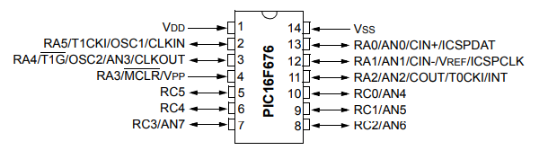

# Guía rápida de PIC16F676
## Referencia del PIC16 utilizado por la marca MICROCHIP
- PIC16F676 y los que aplican adicional...pte informacion

**NOTA** Una guía rápida **NO** incluye el **datasheet**, solo lo esencial que afecta la configuración, el uso de pines, el **ADC**, los periféricos básicos, y los valores iniciales importantes.

## Nombres de los pines

Los nombres de los pines se componen de una letra que indica el puerto y un número que indica el pin. Por ejemplo, **c1** indica el pin **1** del puerto **c**. Todos los nombres en Aixt se escriben en minúsculas [Reglas de nomenclatura de variables V]. (https://github.com/vlang/v/blob/master/doc/docs.md#variables)

Estos pines pueden funcionar como entradas o salidas digitales, entradas analógicas para el **ADC** o desempeñar funciones especiales como reloj, interrupciones o comparadores. Conocer esta nomenclatura permite configurar correctamente cada pin y aprovechar todas las capacidades del microcontrolador sin conflictos entre sus funciones digitales y analógicas.

| Puerto | 0    | 1    | 2    | 3    | 4    | 5    | 6     | 7     |
| :----: | ---- | ---- | ---- | ---- | ---- | ---- | ----- | ----- |
|  **A** | `a0` | `a1` | `a2` | `a3` | `a4` | `a5` | - | - |
|  **C** | `c0` | `c1` | `c2` | `c3` | `c4` | `c5` | - | - |

 Fuente: (https://ww1.microchip.com/downloads/aemDocuments/documents/MCU08/ProductDocuments/DataSheets/40039F.pdf)

## Caracteristicas

|Característica                       | Valor |
|--------------------------------------|-------|
| Tamaño de la memoria del programa (KB) | 1.75  |
 RAM | 64    |
|EEPROM (bytes)                 | 128   |
| Número de pines                      | 14    |
| Voltaje máximo de operación (V)      | 5.5   |
| Voltaje mínimo de operación (V)      | 2     |

Fuente: (https://www.microchip.com/en-us/product/pic16f676)

## Especificaciones Generales

| **Categoría**                  | **Especificación**                                  |
| ------------------------------ | --------------------------------------------------- |
| **Arquitectura**               | 8 bits, núcleo Mid-Range RISC (35 instrucciones)    |
| **Memoria Flash**              | 1K palabras de programa                             |
| **RAM (SRAM)**                 | 64 bytes                                            |
| **EEPROM**                     | 128 bytes                                           |
| **Puertos I/O**                | 12 pines digitales (RA0–RA5, RC0–RC5)               |
| **Canales ADC**                | 8 canales analógicos de 10 bits                     |
| **Comparadores**               | 1 comparador analógico                              |
| **Timers**                     | Timer0 (8 bits), Timer1 (16 bits)                   |
| **Oscilador interno**          | 4 MHz calibrado (OSCCAL)                            |
| **Voltaje de operación**       | 2.0 V a 5.5 V                                       |
| **Consumo**                    | Bajo consumo con modo Sleep                         |
| **Interrupciones**             | INT, Timer0, Timer1, ADC, IOC (interrupt-on-change) |
| **Programación**               | ICSP® (In-Circuit Serial Programming)               |
| **Capacidad de reloj externo** | OSC1/OSC2 disponible                                |

## Configuracion General

```v
import pin
import port
import adc
import time

pin.setup(pin.a0, pin.output) // Pines digitales
pin.setup(pin.a1, pin.input)
pin.setup(pin.a2, pin.output)
pin.setup(pin.c0, pin.input)
pin.setup(pin.c3, pin.output)

pin.digital() // Configurar todos los pines como digitales (ANSEL = 0, CMCON = 0x07)

port.setup(port.a, 0b000000)   // Puerto A como salidas
port.setup(port.c, 0b000011)   // RC0 y RC1 entradas, resto salidas

adc.setup()          // Inicializa ADC
adc.read(0)          // Selecciona AN0 como canal de lectura
```

## Límites Eléctricos

| **Parámetro** | **Valor / Rango**        | **Descripción / Observación**|
| -------------------------------------- | ------------------------ | ---------------------------------------------------------------------------------------- |
| **Voltaje de operación (VDD)**         | **2.0 V – 5.5 V**        | Rango recomendado para funcionamiento normal del microcontrolador.                       |
| **Voltaje máximo en pines**            | **−0.3 V a VDD + 0.3 V** | Límites absolutos para evitar daño en los pines de E/S.                                  |
| **Corriente máxima por pin I/O**       | **25 mA**                | Máxima corriente permitida por pin de salida. No exceder para evitar sobrecalentamiento. |
| **Corriente máxima por puerto**        | **80 mA**                | Suma total de corrientes por puerto A o C. Importante para manejar múltiples LEDs.       |
| **Corriente total del dispositivo**    | **~200 mA** (máx.)       | Límite absoluto del chip. No se debe operar cerca de este valor.                         |
| **Corriente en modo Sleep**            | **< 1 µA típico**        | Consumo ultra bajo cuando se usa SLEEP.                                                  |
| **Frecuencia del oscilador interno**   | **4 MHz**                | Oscilador interno calibrado (precisión ajustable con OSCCAL).                            |
| **Resistencia recomendada para MCLR**  | **10 kΩ**                | Valor típico para pull-up en el pin RA3/MCLR.                                            |
| **Frecuencia máxima de reloj externo** | **20 MHz**               | Solo si se usa cristal o fuente externa (modo HS/XT/EC).                                 |

## Tabla de Registros Clave (TRIS, PORT, ANSEL, ADCON)

| **Registro**             | **Función**             | **Descripción / Para qué sirve**                                                                     |
| ------------------------ | ----------------------- | ---------------------------------------------------------------------------------------------------- |
| **TRIS** (TRISA / TRISC) | Dirección de pines      | 1 = Entrada, 0 = Salida. Define el modo de cada pin antes de usarlo.                                 |
| **PORT** (PORTA / PORTC) | Estado de pines         | Permite **leer** entradas o **escribir** salidas digitales según su configuración en TRIS.           |
| **ANSEL**                | Configuración analógica | Selecciona qué pines funcionan como **entradas analógicas** para el ADC. 1 = Analógico, 0 = Digital. |
| **ADCON0**               | Control del ADC         | Activa el ADC, selecciona canal y ejecuta la conversión.                                             |
| **ADCON1**               | Configuración del ADC   | Ajusta referencias (VDD/VSS), velocidad del ADC y justificación del resultado de 10 bits.            |

## Timer0 y Timer1

| **Timer**  | **Registro(s)**                               | **Función**             | **Descripción / Uso Básico**                                     |
| ---------- | --------------------------------------------- | ----------------------- | ------------------------------------------------------------------------------------------------------------------------------------------------------------------------------------------------- |
| **Timer0** | `OPTION_REG`<br>`INTCON` (T0IF, T0IE)         | Temporizador de 8 bits  | Usa el reloj interno o RA2/T0CKI. Tiene prescaler configurable (1:2 a 1:256). Genera interrupción cuando desborda (T0IF). Ideal para retardos cortos o conteo externo.                            |
| **Timer1** | `T1CON`<br>`PIR1` (TMR1IF)<br>`PIE1` (TMR1IE) | Temporizador de 16 bits | Más preciso que T0. Puede funcionar con reloj interno o externo por pin T1CKI. Admite prescaler (1:1–1:8). Genera interrupción al desbordar. Recomendado para mediciones o temporización estable. |

## Interrupciones (INTCON, IOCA, PIE1, PIR1)

| **Registro** | **Función**                                | **Descripción / Uso Básico**                                    |
| ------------ | ------------------------------------------ | ---------------------------------------------------------------------------------------------------------------------------------------------------------------------------------------------------------------------------------------- |
| **INTCON**   | Control general de interrupciones          | Contiene las banderas y habilitadores principales: **GIE** (interrupciones globales), **PEIE** (periféricas), **T0IE/T0IF** (Timer0), **INTE/INTF** (RA2/INT), **RAIE/RAIF** (cambio en RA). Es el núcleo del sistema de interrupciones. |
| **IOCA**     | Interrupt-on-change en Puerto A            | Activa interrupciones cuando un pin del **Puerto A** cambia de estado. Permite supervisar botones o sensores sin realizar lecturas constantes. |
| **PIE1**     | Habilitación de interrupciones periféricas | Activa interrupciones específicas de módulos internos: **TMR1IE** (Timer1), **ADIE** (ADC), **CMIE** (comparador). Funciona junto con PEIE en INTCON. |
| **PIR1**     | Banderas de interrupciones periféricas     | Indica qué interrupción ocurrió: **TMR1IF**, **ADIF**, **CMIF**, etc. El software debe limpiarlas manualmente después de atender la interrupción.|

## Configuración del Oscilador

| **Componente / Registro** | **Función**                                | **Descripción / Uso Básico**      |
| ------------------------- | ------------------------------------------ | --------------------------------------------------------------------------------------------------------------------------------------------------------------------------------------------- |
| **OSCCAL**                | Calibración del oscilador interno          | Ajusta la frecuencia del oscilador interno (aprox. 4 MHz). El valor viene grabado de fábrica y debe cargarse al iniciar el programa. No se modifica salvo que se necesite precisión especial. |
| **Modo de Oscilador**     | Selección en bits de configuración (fuses) | Permite elegir **INTOSC**, **LP**, **XT**, **HS** o **EC**. En la mayoría de aplicaciones se usa el **oscilador interno de 4 MHz**.  |
| **OSC1/CLKIN (RA5)**      | Entrada de reloj externo                   | Si se usa cristal o reloj externo, esta es la entrada principal.             |
| **OSC2/CLKOUT (RA4)**     | Salida de reloj                            | En modo de reloj externo, proporciona la señal de salida del oscilador. En modos internos puede actuar como pin digital/AN3.           |
| **Frecuencia interna**    | Frecuencia predeterminada                  | El PIC opera con **4 MHz internos**, suficientes para la mayoría de aplicaciones sin cristal externo.                   |

## Modos de Reset y WDT

| **Modo / Registro**       | **Función**                   | **Descripción / Uso Básico**  |
| ------------------------- | ----------------------------- | ----------------------------------------------------------------------------------------------------------------------------- |
| **POR (Power-On Reset)**  | Reset por encendido           | Se activa automáticamente cuando el PIC recibe alimentación. Garantiza que el microcontrolador arranque en un estado estable. |
| **MCLR (Reset Externo)**  | RA3/MCLR                      | Al llevar MCLR a nivel bajo, el PIC se reinicia. Útil para depuración o botones de reinicio.                                  |
| **BOR (Brown-Out Reset)** | Protección por bajo voltaje   | Reinicia el PIC si VDD cae por debajo de un umbral crítico. Evita funcionamiento inestable por baja tensión.                  |
| **WDT (Watchdog Timer)**  | Reinicio por tiempo excedido  | Reinicia el PIC si el programa se “congela” o tarda demasiado en ejecutarse. Requiere instrucciones periódicas **CLRWDT**.    |
| **WDTCON**                | Control del WDT               | Permite activar/desactivar el WDT (si los fuses lo permiten). También controla el prescaler del temporizador.                 |
| **PCON**                  | Indica causa del último reset | Permite saber si el reset fue por BOR, POR, WDT o MCLR. Útil para diagnóstico del sistema.                                    |
| **SLEEP**                 | Modo de bajo consumo          | El PIC entra en consumo mínimo; sale del modo por interrupciones o por WDT.  |

## Ejemplo, uso de pines

```v
pin.high(pin.a0) // Escribir pines
pin.low(pin.c3)

pin.toggle(pin.a2) // Alternar un pin

value := pin.read(pin.c0) // Leer un pin

pin.write(pin.a0, pin.read(pin.c0)) // Eco (entrada → salida)
```

## Ejemplo de ADC

```v
adc_val := adc.read(0)

if adc_val > 512 {
    pin.high(pin.c3)
} else {
    pin.low(pin.c3)
}
```

## Ejemplo de tiempo

```v
time.sleep_ms(500)
```