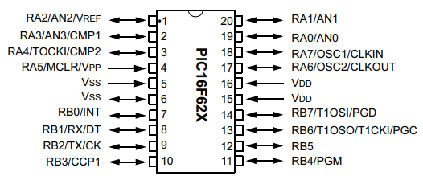

# Guia Rápida para PIC16F62X
## Referencia del PIC16 utilizado de la marca MICROCHIP
- PIC16F62X (PIC16F627, PIC16F627A, PIC16F628 y PIC16F628A)  

**NOTA:** Microcontrolador de 8 bits, RISC, la familia PIC16F62x es la única en su categoría que combina compatibilidad pin-a-pin con el viejo PIC16F84, pero añade tres periféricos mayores (**USART, PWM–CCP y comparadores**), además de permitir desactivar módulos analógicos para recuperar todos los pines digitales.

## Nombres de los Pines
Los nombres de los pines se nombran con una letra que indica el puerto y un número que indica el pin. Por ejemplo `b6` indica el pin 6 del puerto B. Todos los nombres en **Aixt** estan escritos en minúsculas, para seguir. [V variable naming rules.] (https://github.com/vlang/v/blob/master/doc/docs.md#variables).

| Puerto | 0    | 1    | 2    | 3    | 4    | 5    | 6     | 7     |
| :----: | ---- | ---- | ---- | ---- | ---- | ---- | ----- | ----- |
|  **A** | `a0` | `a1` | `a2` | `a3` | `a4` | `a5` | ----- | ----- |
|  **B** | `b0` | `b1` | `b2` | `b3` | `b4` | `b5` | `b6`  | `b7`  |

- **a4** → salida tipo **open-drain**, igual que en PIC16F84.
- **a0–a3** → pueden funcionar como entradas del comparador **(CMCON)**.
- **b0** → entrada de interrupción **INT**.
- **b4–b7** → interrupciones por cambio de estado **(Port Change)**.

**PDIP, SOIC (Plastic Dual In-line Package, Small Outline Integrated Circuit)**

- **Plastic Dual In-line Package:** Es el encapsulado grande, con pines a los lados, usado para prototipos y breadboards, fácil de soldar y cabe en protoboard.
- **Small Outline Integrated Circuit:** Encapsulado SMD (montaje superficial), mediano, compacto, no se puede usar en protoboard sin adaptador.


**SSOP (Shrink Small Outline Package)** Versión pequeña, pines muy finos, compacto, ideal para equipos portátiles, soldadura especializada.
Fuente: (https://ww1.microchip.com/downloads/en/DeviceDoc/40300c.pdf)

## Especificaciones Pricipales

| Nº | Especificación       | Valor típico                               |
| -- | -------------------- | ------------------------------------------ |
| 1  | Memoria de programa  | 1K a 4K instrucciones (depende del modelo) |
| 2  | RAM                  | 224 bytes                                  |
| 3  | EEPROM               | **128 bytes (todos los PIC16F62x)**        |
| 4  | Pines totales        | 18                                         |
| 5  | Voltaje de operación | 2.0 V – 5.5 V                              |
| 6  | Frecuencia máxima    | 20 MHz                                     |

## Caracteristicas

| Nº | Característica          | Descripción / Valor                |
| -- | ----------------------- | ---------------------------------- |
| 1  | Arquitectura            | Microcontrolador RISC 8 bits       |
| 2  | Pines digitales         | 15 (PORTA + PORTB)                 |
| 3  | EEPROM                  | 128 bytes                          |
| 4  | PWM                     | Disponible en 628(A) y 648A (CCP1) |
| 5  | USART (serial)          | **Sí**, en 627A/628A/648A          |
| 6  | Comparadores analógicos | Sí, con desactivación por CMCON    |
| 7  | Timers                  | TMR0, TMR1, TMR2                   |
| 8  | Interrupciones          | 12 fuentes disponibles             |
| 9  | Watchdog Timer          | Sí                                 |
| 10 | Sleep Mode              | Sí                                 |
| 11 | Frecuencia máx              | Hasta 20 MHz (200 ns por ciclo)                                |
| 12 | Memoria de programa              | 1K palabras (16F627) / 2K palabras (16F628/628A)                                |
| 13 | RAM              | 224 bytes                                |
| 14 | Voltaje de operación              | 3.0–5.5 V (F62x) / 2.0–5.5 V (LF62x)                                |

## Codigo Base Aixt (E/S)

```v
import pin

// Configuración de pines
pin.setup(pin.b0, pin.output)
pin.setup(pin.a1, pin.input)

// Escritura digital
pin.high(pin.b0)
pin.low(pin.a3)

// Alternar
pin.toggle(pin.b7)

// Lectura
value := pin.read(pin.a1)

// Eco entrada → salida
pin.write(pin.b2, pin.read(pin.a1))
```

## Oscilador y MCLR

- **`MCLR`** configurable como entrada digital (solo en versiones A), ajustable según osiloscopio = la constante **CPU_FREQ** depende de la frecuencia del oscilador externo conectado al PIC.
- Modos de oscilador:
  - LP, XT, HS (cristal), 
  - RC
  - Oscilador externo se conecta los pines **OSC1/OSC2**
  - **INTOSC (oscilador interno)** → solo en 628A/648A

  ## Temporizadores

| Timer | Bits          | Función                 |
| -- | ----------------------- | ---------------------------------- |
| **TMR0** | 8 bits  | general/contador, prescaler |
| **TMR1** | 16 bits | temporizador con prescaler  |
| **TMR2** | 8 bits  | base de tiempo para PWM     |

## Retardos
```v
import time

time.sleep(2)      // Retardo de 2 segundos
time.sleep_ms(50)  // Retardo de 50 milisegundos
time.sleep_us(100) // Retardo de 100 microsegundos

@[as_macro] // Los retardos dependen de la frecuencia del microcontrolador, se debe asegurar que CPU_FREQ coincida con la frecuencia de tu oscilador
pub const CPU_FREQ: u32 = 4_000_000 // 4 MHz
```

## Módulos integrados
- **USART (Serial) - Transmisor/Receptor Universal Síncrono/Asíncrono**
  - Disponible en 16F627A / 628A / 648A.
  - Permite transmisión y recepción asíncrona (9600, 19200, etc.).

| Registro | Función                 |
| -- | --------------------------------------------- |
| **TXSTA** | Control del transmisor                        |
| **RCSTA** | Control del receptor                          |
| **SPBRG** | Generador de velocidad de baudios (baud rate) |

- **PWM (CCP1) - Modulación por Ancho de Pulso**
  - Disponible en 16F628(A) y 648A.
  - Resolución: 10 bits para el duty cycle.
  - Trabaja junto con TMR2; no requiere que el CPU genere la señal manualmente

| Registro    | Función                                  |
| ----------- | ---------------------------------------- |
| **CCP1CON** | Configuración del módulo CCP1 (modo PWM) |
| **PR2**     | Determina el período del PWM             |
| **TMR2**    | Temporizador base del PWM                |
| **CCPR1L**  | Ajusta el ciclo de trabajo (duty cycle)  |

- **Comparadores**
  - Dos comparadores que pueden deshabilitarse con **(CMCON = 0x07)** para usar **RA0–RA3** como digitales.
  - No mide voltaje.
  - Disponible en toda la familia PIC16F62X.
  - Entradas: V+ y V- (dos voltajes a comparar).
  - Salida: (1 (alto) → si V+ > V-) y (0 (bajo) → si V+ < V-)        
  - La salida puede conectarse internamente a periféricos, como el temporizador TMR0, interrupciones o incluso al pin digital correspondiente.

 | Registro    | Función                                  |
| ----------- |  --------------------------------------------------------- |
| **CMCON** | Configura y habilita/deshabilita los comparadores.        |
| **VREF**  | Referencia de voltaje programable para las comparaciones. |

## EEPROM (Electrically Erasable Programmable Read-Only Memory)

- 128 bytes de memoria no volátil.
- Se escribe mediante registros EECON1, EECON2, EEADR, EEDATA.
- Proceso de escritura con protección de desbloqueo.
- Retiene datos, la RAM se pierden lso datos al apagar.
- Guarda configuracion o contadores.

| Registro   | Función                                                 |
| ---------- | ------------------------------------------------------- |
| **EECON1** | Control de operaciones de lectura/escritura de EEPROM   |
| **EECON2** | Secuencia de desbloqueo para escritura (proceso seguro) |
| **EEADR**  | Dirección del byte a leer o escribir                    |
| **EEDATA** | Dato que se leerá o escribirá                           |

## Registro Principales

| Nº | Registro        | Función                        |
| -- | --------------- | ------------------------------ |
| 1  | PORTA           | Entradas/salidas RA0–RA5       |
| 2  | PORTB           | Entradas/salidas RB0–RB7       |
| 3  | TRISA           | Dirección del puerto A         |
| 4  | TRISB           | Dirección del puerto B         |
| 5  | TMR0            | Temporizador 0                 |
| 6  | TMR1/T1CON      | Temporizador 1                 |
| 7  | TMR2/T2CON      | Temporizador 2                 |
| 8  | CMCON           | Comparadores                   |
| 9  | CCP1CON         | Control PWM (modelos con CCP1) |
| 10 | TXSTA / RCSTA   | Control del USART              |
| 11 | INTCON          | Interrupciones principales     |
| 12 | PIE1 / PIR1     | Flags de periféricos           |
| 13 | EECON1 / EECON2 | Control EEPROM                 |

## Uso típico

Los PIC16F62x son ideales para:

- Reemplazar el viejo **PIC16F84** con más funciones.
- Control de motores pequeños con PWM.
- Comunicación serial en proyectos simples.
- Medición digital con interrupciones RB0 o cambio en RB4–RB7.
- Entradas digitales con debouncing por interrupciones.
- Sistemas de bajo consumo en modo Sleep.