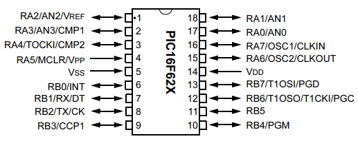
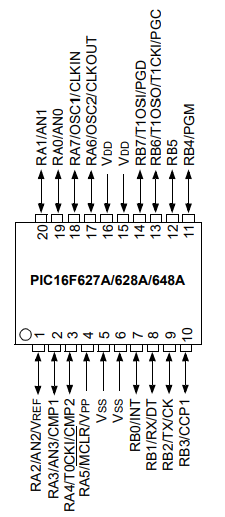

# Guia Rápida para PIC16F6xx_18p
## Referencia del PIC16 utilizado de la marca MICROCHIP
- PIC16F6xx_18p (Incluye PIC16F627, PIC16F627A, PIC16F628, PIC16F628A y PIC16F648A)  

**NOTA:** Microcontrolador de 8 bits, RISC, la familia PIC16F6xx_18p es compatible pin-a-pin con el PIC16F84, pero añade periféricos avanzados como **USART**, **PWM** **CCP1** y comparadores analógicos, además de permitir desactivar módulos analógicos para recuperar todos los pines como digitales.

| Modelo     | Flash | USART | PWM (CCP1) | Osc. interno |
| ---------- | ----- | ----- | ---------- | ------------ |
| PIC16F627  | 1K    | NO     | NO          | NO            |
| PIC16F627A | 1K    | SI     | NO          | NO            |
| PIC16F628  | 2K    | NO     | SI          | NO            |
| PIC16F628A | 2K    | SI     | SI          | SI            |
| PIC16F648A | 4K    | SI     | SI          | SI            |

## Nombres de los Pines
Los nombres de los pines se nombran con una letra que indica el puerto y un número que indica el pin. Por ejemplo `b6` indica el pin 6 del puerto B. Todos los nombres en **Aixt** estan escritos en minúsculas, para seguir. [V variable naming rules.] (https://github.com/vlang/v/blob/master/doc/docs.md#variables).

| Puerto | 0    | 1    | 2    | 3    | 4    | 5    | 6     | 7     |
| :----: | ---- | ---- | ---- | ---- | ---- | ---- | ----- | ----- |
|  **A** | `a0` | `a1` | `a2` | `a3` | `a4` | `a5` | ----- | ----- |
|  **B** | `b0` | `b1` | `b2` | `b3` | `b4` | `b5` | `b6`  | `b7`  |

- **a4** → salida tipo **open-drain**, igual que en PIC16F84.
- **a0–a3** → pueden funcionar como entradas del comparador **(CMCON)**.
- **b0** → entrada de interrupción **INT**.
- **b4–b7** → interrupciones por cambio de estado **(Port Change)**.
- **a5** → puede funcionar como **MCLR** o entrada digital (configurable, modelos A).

**PDIP, SOIC (Plastic Dual In-line Package, Small Outline Integrated Circuit)**

- **Plastic Dual In-line Package:** Es el encapsulado grande, con pines a los lados, usado para prototipos y breadboards, fácil de soldar y cabe en protoboard.
- **Small Outline Integrated Circuit:** Encapsulado SMD (montaje superficial), mediano, compacto, no se puede usar en protoboard sin adaptador.

Fuente: (https://ww1.microchip.com/downloads/en/DeviceDoc/40044E.pdf)

Fuente: (https://ww1.microchip.com/downloads/aemDocuments/documents/MCU08/ProductDocuments/DataSheets/40300C.pdf)

**SSOP (Shrink Small Outline Package)** Versión pequeña, pines muy finos, compacto, ideal para equipos portátiles, soldadura especializada.
 
Fuente: (https://ww1.microchip.com/downloads/en/DeviceDoc/40044E.pdf)

Fuente: (https://ww1.microchip.com/downloads/aemDocuments/documents/MCU08/ProductDocuments/DataSheets/40300C.pdf)

## Especificaciones Principales

| Característica (PIC16F627A*/628A/648A)    | Valor |
| ---------------------------------- | ----- |
| Tamaño de memoria de programa (KB) | 1.75*  |
| RAM (bytes)                        | 224   |
| EEPROM de datos (bytes)            | 128   |
| Número de pines                    | 18    |
| Voltaje máximo de operación (V)    | 5.5   |
| Voltaje mínimo de operación (V)    | 2.0   |

Fuente: (https://www.microchip.com/en-us/product/pic16f627a)

| Característica (PIC16F627/28)           | Valor |
| ---------------------------------------- | ----- |
| Resolución ADC máxima (bits)             | 0     |
| Número de comparadores                   | 2     |
| EEPROM de datos (bytes)                  | 128   |
| Data Signal Modulator (DSM)              | 0     |
| Oscilador Controlado Numéricamente (NCO) | 0     |
| Voltaje máximo de operación (V)          | 5.5   |

Fuente: (https://www.microchip.com/en-us/product/pic16f627)

## Caracterìsticas

Disponen de 18 pines, hasta 4K palabras de memoria de programa, 224 bytes de **RAM**, 128 bytes de **EEPROM**, operan entre 2.0 y 5.5 V y alcanzan hasta 20 MHz, siendo adecuados para control simple, comunicación serial y sistemas embebidos compactos.

| Característica          | Descripción                                   |
| ----------------------- | --------------------------------------------- |
| Arquitectura            | Microcontrolador **RISC de 8 bits**           |
| Modelos incluidos       | PIC16F627, 627A, 628, 628A, 648A              |
| Encapsulados            | **PDIP-18, SOIC-18, SSOP-18**                 |
| Compatibilidad          | **Pin-a-pin con PIC16F84**                    |
| Memoria de programa     | **1K / 2K / 4K palabras** (según modelo)      |
| RAM                     | **224 bytes**                                 |
| EEPROM de datos         | **128 bytes**                                 |
| Pines de E/S            | **15 pines digitales** (PORTA + PORTB)        |
| Voltaje de operación    | **2.0–5.5 V (LF)** / **3.0–5.5 V (F)**        |
| Frecuencia máxima       | **20 MHz**                                    |
| Oscilador interno       | **Solo en 628A y 648A**                       |
| Timers                  | **TMR0 (8-bit), TMR1 (16-bit), TMR2 (8-bit)** |
| PWM (CCP1)              | **628 / 628A / 648A**                         |
| USART                   | **627A / 628A / 648A**                        |
| Comparadores analógicos | **2 comparadores**, deshabilitables           |
| Interrupciones          | **INT externa + cambio en RB4–RB7**           |
| Watchdog Timer          | Sí                                            |
| Modo Sleep              | Sí                                            |
| ADC                     | **No disponible**                             |

## Codigo Base Aixt (E/S)

```v
import pin

// Configuración de pines
pin.setup(pin.b0, pin.output)
pin.setup(pin.a1, pin.input)

// Escritura digital
pin.high(pin.b0)
pin.low(pin.a3)

// Alternar
pin.toggle(pin.b7)

// Lectura
value := pin.read(pin.a1)

// Eco entrada → salida
pin.write(pin.b2, pin.read(pin.a1))
```

## Oscilador y MCLR

`MCLR/a5` puede configurarse como entrada digital solo en los modelos A (PIC16F627A, 628A y 648A) mediante los bits de configuración; en los modelos no A funciona exclusivamente como reset externo.

La constante **CPU_FREQ** debe coincidir con la frecuencia real del oscilador (interno o externo) para que los retardos y temporizaciones sean correctos.

Modos de oscilador externo:
- **LP**, **XT**, **HS** (cristal o resonador),
- **RC**.

El oscilador externo se conecta a los pines OSC1/OSC2.

Oscilador interno **INTOSC** disponible solo en PIC16F628/28A y PIC16F648A, permitiendo operación sin oscilador externo.

  ## Temporizadores

| Temporizador | Tamaño  | Descripción |
| ------------ | ------- | ---------------------------------------------------------------------------------------------------------------------------------------- |
| **TMR0**     | 8 bits  | Temporizador/contador de propósito general, con **prescaler** compartido con el Watchdog Timer; puede contar pulsos externos o internos. |
| **TMR1**     | 16 bits | Temporizador de alta resolución con prescaler configurable, ideal para mediciones precisas y generación de interrupciones periódicas.    |
| **TMR2**     | 8 bits  | Temporizador con **postscaler**, utilizado como base de tiempo para el **módulo PWM (CCP1)** en los modelos que lo incluyen.             |

## Retardos

Los retardos se implementan por software y son adecuados para tareas simples, para temporizaciones más precisas o no bloqueantes, se recomienda el uso de temporizadores tipo **TMR0, TMR1 o TMR2**.

```v
import time

time.sleep(2)      // Retardo de 2 segundos
time.sleep_ms(50)  // Retardo de 50 milisegundos
time.sleep_us(100) // Retardo de 100 microsegundos

@[as_macro] // Los retardos dependen de la frecuencia del microcontrolador, se debe asegurar que CPU_FREQ coincida con la frecuencia de tu oscilador
pub const CPU_FREQ: u32 = 4_000_000 // 4 MHz
```

## Módulos integrados
- **USART (Serial) - Transmisor/Receptor Universal Asíncrono**
  - Disponible en 16F627A / 628A / 648A.
  - Soporta comunicación serial asíncrona (por ejemplo 9600, 19200 bps).
  - Utiliza hardware dedicado, reduciendo la carga del CPU.

| Registro | Función                 |
| -- | --------------------------------------------- |
| **TXSTA** | Control del transmisor                        |
| **RCSTA** | Control del receptor                          |
| **SPBRG** | Generador de velocidad de baudios (baud rate) |

- **PWM (CCP1) - Modulación por Ancho de Pulso**
  - Disponible en 16F628/28A y 648A.
  - Resolución: 10 bits para el ciclo de trabajo (duty cycle).
  - Trabaja junto con TMR2; no requiere que el CPU genere la señal manualmente

| Registro    | Función                                  |
| ----------- | ---------------------------------------- |
| **CCP1CON** | Configuración del módulo CCP1 (modo PWM) |
| **PR2**     | Determina el período del PWM             |
| **TMR2**    | Temporizador base del PWM                |
| **CCPR1L**  | Ajusta el ciclo de trabajo (duty cycle)  |

- **Comparadores**
  - Dos comparadores analógicos disponibles en toda la familia **PIC16F6xx_18p**.
  - Pueden deshabilitarse mediante `CMCON = 0x07` para usar los pines **a0–a3** como entradas/salidas digitales.
  - No realizan conversión analógica–digital (no miden voltaje, solo comparan niveles).
  - Entradas: V+ y V- (dos voltajes a comparar).
  - Salida: (1 (alto) → si V+ > V-) y (0 (bajo) → si V+ < V-)        
  - La salida puede enrutarse internamente a periféricos como interrupciones o usarse como señal lógica, sin necesidad de hardware externo.

 | Registro    | Función                                  |
| ----------- |  --------------------------------------------------------- |
| **CMCON** | Configuraciòn y habilitaciòn de los comparadores.        |
| **VRCON**  | Generación de referencia de voltaje interna. |

## EEPROM (Electrically Erasable Programmable Read-Only Memory)

- 128 bytes de memoria no volátil.
- Se escribe mediante registros EECON1, EECON2, EEADR, EEDATA.
- Proceso de escritura con protección de desbloqueo.
- Retiene los datos aun sin alimentación; la RAM pierde su contenido al apagar.
- Guarda configuraciòn o contadores.

| Registro   | Función                                                 |
| ---------- | ------------------------------------------------------- |
| **EECON1** | Control de operaciones de lectura/escritura de EEPROM   |
| **EECON2** | Secuencia de desbloqueo para escritura (proceso seguro) |
| **EEADR**  | Dirección del byte a leer o escribir                    |
| **EEDATA** | Dato que se leerá o escribirá                           |

## Registro Principales

| Registro           | Función           |
| ------------------ | ----------------- |
| PORTA / PORTB      | E/S               |
| TRISA / TRISB      | Dirección         |
| INTCON             | Interrupciones    |
| PIE1 / PIR1        | Flags periféricos |
| TMR0 / TMR1 / TMR2 | Timers            |
| CMCON              | Comparadores      |
| CCP1CON            | PWM               |
| TXSTA / RCSTA      | USART             |

## Uso típico

- Reemplazar el viejo **PIC16F84** con más funciones.
- Control de motores pequeños con PWM.
- Comunicación serial en proyectos simples.
- Medición digital con interrupciones `b0` o cambio en `b4–b7`.
- Entradas digitales con debouncing por interrupciones (el debouncing no lo realiza el hardware automáticamente, se implementa por software).
- Sistemas de bajo consumo en modo Sleep.