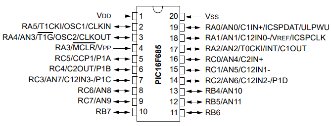
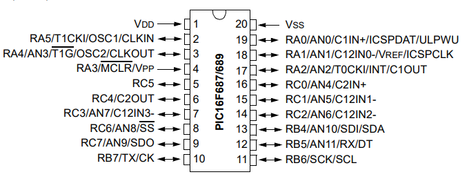
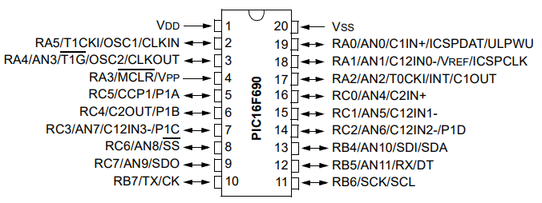

# Quick Guide for PIC16F6xx_20p
## Reference for the PIC16 by MICROCHIP
- **PIC16F6xx_20p** (Includes **PIC16F685**, **PIC16F687**, **PIC16F689**, and **PIC16F690**)  

**NOTE:** 8-bit microcontroller, RISC architecture. The **PIC16F6xx_20p** family offers more pins and peripherals than the 18p series. It includes **ADC**, comparators, **USART**, **PWM (CCP1)**, internal oscillator, internal voltage reference **FVR**, and advanced digital modules, making it ideal for control, analog signal acquisition, and serial communication.

## Pin Names
Pin names consist of a letter for the port and a number for the pin. For example, `c3` indicates pin 3 of port C. All names in **Aixt** are written in lowercase to follow [V variable naming rules](https://github.com/vlang/v/blob/master/doc/docs.md#variables).

| Port | 0 | 1 | 2 | 3 | 4 | 5 | 6 | 7 |
| :--: |:-:|:-:|:-:|:-:|:-:|:-:|:-:|:-:|
| **A** | a0 | a1 | a2 | a3 | a4 | a5 | a6 | a7 |
| **B** | b0 | b1 | b2 | b3 | b4 | b5 | b6 | b7 |
| **C** | c0 | c1 | c2 | c3 | c4 | c5 | c6 | c7 |

| Special Pin | Main Functions |
| ----------- | -------------- |
| **a0–a7**   | Analog inputs (ADC, multiplexed with digital pins) |
| **a5**      | MCLR (Reset) or digital input (configurable) |
| **b0**      | External interrupt INT |
| **b4–b7**   | Port change interrupts |
| **c2**      | PWM (CCP1) |
| **c6**      | USART TX (if applicable) |
| **c7**      | USART RX (if applicable) |
| **Other C pins** | Multiplexed with ADC, timers, or general digital functions |

**ADC pins:** Require **ANSEL / ANSELH** configuration to enable/disable analog function.  
**Multiplexed pins:** Many pins can operate as digital or peripheral (**ADC, PWM, USART**).  
**MCLR/a5:** On models that allow it, can be used as a digital input; otherwise, only reset.

**20-pin PDIP, SOIC, SSOP**

  
  
  
Source: [Microchip Datasheet](https://ww1.microchip.com/downloads/aemDocuments/documents/OTH/ProductDocuments/DataSheets/40001262F.pdf)

## Main Specifications

| Model | Program Memory (KB) | RAM (bytes) | EEPROM (bytes) | Pins | Operating Voltage (V) | ADC | PWM (CCP1) | USART | Internal Oscillator |
|-------|-------------------|------------|----------------|------|--------------------|-----|------------|-------|------------------|
| **PIC16F685** | 7 | 256 | 256 | 20 | 2.0 – 5.5 | 8ch | Yes | No | Yes |
| **PIC16F687** | 3.5 | 128 | 256 | 20 | 2.0 – 5.5 | 8ch | Yes | Yes | Yes |
| **PIC16F689** | 7 | 256 | 256 | 20 | 2.0 – 5.5 | 12ch | Yes | Yes | Yes |
| **PIC16F690** | 7 | 256 | 256 | 20 | 2.0 – 5.5 | 12ch | Yes | Yes | Yes |

**ADC:** 10-bit resolution; some models have 8 channels (685, 687), others 12 (689, 690).  
**PWM (CCP1):** All models include a **PWM** module using **TMR2**.  
**USART:** Not available on **PIC16F685**, available on 687, 689, 690.  
**Internal oscillator:** All models can operate without an external crystal.  
**EEPROM:** 256 bytes, useful for persistent data storage.  

Sources: (https://www.microchip.com/en-us/product/pic16f685)  
(https://www.microchip.com/en-us/product/pic16f687)  
(https://www.microchip.com/en-us/product/pic16f689)  
(https://www.microchip.com/en-us/product/pic16f690)

## Features

- All **ADC** pins require **ANSEL / ANSELH** configuration.  
- **PORTC** pins are multiplexed with **PWM**, **USART**, and **ADC**.  
- `MCLR/a5` can function as digital input on some models.  
- Suitable for motor control, serial communication, analog signal acquisition, and compact embedded systems.

| Feature | Description |
|---------|------------|
| **Architecture** | 8-bit **RISC** |
| **Packages** | PDIP-20, SOIC-20, SSOP-20 |
| **Program memory** | 3.5 KB – 7 KB (depending on model) |
| **RAM** | 128 – 256 bytes |
| **Data EEPROM** | 256 bytes |
| **I/O pins** | 20 digital pins (PORTA, PORTB, PORTC) |
| **Operating voltage** | 2.0 – 5.5 V |
| **Max frequency** | 20 MHz |
| **Internal oscillator** | Yes, up to 8 MHz |
| **ADC** | 10-bit resolution, 8–12 channels |
| **PWM (CCP1)** | Yes, uses TMR2 as time base |
| **USART** | Yes (except PIC16F685) |
| **Analog comparators** | 2, can be disabled via CMCON0 |
| **Interrupts** | External (INT) + port change (PORTB4–PORTB7) |
| **Watchdog Timer** | Yes |
| **Sleep mode** | Yes |
| **Internal voltage reference** | Yes, controlled via VRCON/FVRCON |
| **Timers** | TMR0 (8-bit), TMR1 (16-bit), TMR2 (8-bit) |
| **Software delays** | Compatible with Aixt (`time.sleep`, `time.sleep_ms`, `time.sleep_us`) |

## Aixt Base Code (I/O)

**ADC** pins (a0–a7): must be configured in **ANSEL/ANSELH** if used as digital inputs.
**USART**: `TX` → `c6`, `RX` → `c7` (USART models only).
**PWM (CCP1)**: pin `c2`, requires configuring TMR2 and CCP1CON for true PWM.
**Interrupts**: pin `b0` → external **INT**, pins `b4–b7` → interrupt on change of state.
This code provides a basic understanding of digital I/O handling. For true **ADC** or **PWM**, dedicated modules must be used.

```v
import pin

// Pin configuration
pin.setup(pin.a0, pin.input)    // Analog or digital input
pin.setup(pin.b0, pin.input)    // External interrupt
pin.setup(pin.b2, pin.output)   // Digital output
pin.setup(pin.c2, pin.output)   // PWM or digital output
pin.setup(pin.c6, pin.output)   // USART TX (if applicable)
pin.setup(pin.c7, pin.input)    // USART RX (if applicable)

// Digital write
pin.high(pin.b2)  // Set B2 high
pin.low(pin.c2)   // Set C2 low

// Toggle state
pin.toggle(pin.b7)

// Digital read
value := pin.read(pin.a0)

// Echo input → output
pin.write(pin.b2, pin.read(pin.a0))

// Example: multiple read and output
adc_value := pin.read(pin.a1)
pin.write(pin.c2, adc_value > 512) // Simplified digital PWM output
```

## Oscillator

All models include an internal oscillator configurable via software.
**Typical frequencies**: 31 kHz – 8 MHz, sufficient for serial communication, timers, and PWM.
It allows operation without an external crystal, simplifying the design.
The constant `CPU_FREQ` must match the actual oscillator frequency for accurate delays and timings.

```v
@[as_macro]
pub const CPU_FREQ: u32 = 8_000_000 // 8 MHz
```

Also supports external oscillators (crystal or resonator):

- `LP` – Low frequency
- `XT` – Standard crystal/resonator
- `HS` – High speed
- `RC` – External RC oscillator

Connect to the **OSC1/OSC2** pins.

## MCLR (Master Clear/Reset)

Pin `a5` functions as an external MCLR (reset) or as a digital input on models that support it (PIC16F685, 687, 689, 690).
Configuration is done using the microcontroller's configuration bits.
If used as a reset, it must be connected to **VDD** via a **pull-up** resistor and to a push button or external signal.
In digital mode, **TRISA5** must be configured as an input.

## Timers

Prescalers and postscalers allow you to adjust the timer count rate.
**TMR2** is used directly for **PWM**, freeing the **CPU** from manually generating the signal.
Timers can be used for precise or non-blocking delays, avoiding reliance solely on software delays (time.sleep).
Interrupts: Each timer can generate interrupts when it overflows, allowing periodic actions without blocking the CPU.

| Timer | Size | Description |
------------ | ------- | ------------------------------------------------------------------------------------------------------------------------------------------------ |
**TMR0** | 8 bits | General-purpose timer/counter. Can use a shared prescaler with the Watchdog Timer. Allows counting internal or external pulses. |
**TMR1** | 16 bits | High-resolution timer, ideal for precise measurements, generating periodic interrupts, or controlling timed events. |
**TMR2** | 8 bits | Timer with **postscaler**, used as a time base for the **PWM module (CCP1)**. Configurable for simple timing tasks. |

## Delays

Delays can be implemented in software or using timers. Software delays are suitable for simple tasks; for precise or non-blocking timing, it is recommended to use timers **TMR0, TMR1, or TMR2**.

```v
import time

time.sleep(2) // 2-second delay

time.sleep_ms(50) // 50-millisecond delay

time.sleep_us(100) // 100-microsecond delay

@[as_macro]
pub const CPU_FREQ: u32 = 8_000_000 // 8 MHz
// The CPU_FREQ constant must match the actual oscillator frequency for accurate delays.
```

For tasks requiring microsecond precision or exact timing, it is recommended to use **TMR0/TMR1/TMR2** instead of software delays.
Software delays block the **CPU**, so they are not recommended for multitasking applications or critical interrupts.

## Integrated Modules
- **ADC (Analog-to-Digital Converter)**

**Resolution**: 10 bits
**Channels**: 8–12, depending on the model
**Pins**: a0–a7 (multiplexed)
Controlled by **ADCON0 and ADCON1** registers
Requires configuring **ANSEL / ANSELH** to enable/disable analog function

| Register | Function |
| -------------------------------- | ----------------------- |
| PORTA/B/C | Digital I/O |
| TRISA/B/C | Pin Addressing |
| INTCON | Interrupts |
| PIE1 / PIR1 | Peripheral Flags |
| TMR0 / TMR1 / TMR2 | Timers |
| CCP1CON | PWM |
| TXSTA / RCSTA | USART |
| ADCON0 / ADCON1 | ADC |
| CMCON0 / VRCON | Analog Comparators |
| EECON1 / EECON2 / EEADR / EEDATA | EEPROM |

- **PUSART (Universal Asynchronous Transmitter/Receiver)**
Available on **PIC16F687**, 689, 690
Pins: c6 → TX, c7 → RX
Enables serial communication at different baud rates
Uses dedicated hardware, freeing up **CPU**

| Register | Function |
| -------- | --------------------------------- |
**TXSTA** | Transmitter Control |
**RCSTA** | Receiver Control |
**SPBRG** | Baud Rate Generator |

- **PWM (CCP1)**
**Pin**: c2
**Resolution**: 10 bits for duty cycle
Synchronizes with **TMR2**, does not require **CPU** to generate signal
Ideal for motor and LED control

| Register | Function |
| -------- | ---------------------------------------- |
**CCP1CON** | CCP1 Module Configuration (PWM Mode) |
**PR2** | Determines the PWM Period |
**TMR2** | PWM Base Timer |
**CCPR1L** | Adjusts the Duty Cycle |

- **Analog Comparators**
Two integrated comparators
Inputs multiplexed with ADC pins
Disableable via **CMCON0 = 0x07** to use the pins as digital inputs
Output: 1 → V+ > V-, 0 → V+ < V-
Output can be used for interrupts or internal logic
Configure **FVRCON** for a reference of 1.024V, 2.048V, or 4.096V.

| Register | Function |
| -------- | ----------------------------- |
| CMCON0 | Comparator Configuration |
| VRCON | Internal Voltage Reference |

- **EEPROM**

256 bytes of non-volatile memory. 
Saves configurations or counters even when power is turned off.

| Register | Function |
| -------- | -------------------------------------- |
**EECON1** | Read/Write Control |
**EECON2** | Write Unlock Sequence |
**EEADR** | Address of the byte to read/write |
**EEDATA** | Data to be read or written |

All modules are multiplexed with **I/O** pins, so it is necessary to correctly configure **TRIS, ANSEL/ANSELH**, and the control registers.
The comparators and **ADC** can coexist; it is recommended to disable the comparators if all pins need to be used as digital.
**USART** and **PWM** free the **CPU** from manually generating signals, optimizing performance.

## ADC (Analog-to-Digital Converter)

The **PIC16F6xx_20p** family incorporates a 10-bit ADC, allowing direct conversion of analog signals to digital values, a feature absent in the 18p series.

**Resolution**: 10 bits (0–1023)
**ADC Channels**: between 8 and 12, depending on the model
**References**: VDD / VSS or internal reference
Hardware-controlled conversion

| Register | Function |
| ---------- | ---------------------------------------------------- |
**ADCON0** | Channel selection and conversion start control |
**ADCON1** | Result justification and voltage reference |
**ADRESH** | High conversion result |
**ADRESL** | Low conversion result |

| Model | ADC Channels per Model |
--------- | ----------- |
| PIC16F685 | 8 |
| PIC16F687 | 8 |
| PIC16F689 | 12 |
| PIC16F690 | 12 |

## Analog Configuration (ANSEL / ANSELH)

Pins with ADC capability start in analog mode by default.
To use them as digital pins, it is mandatory to disable the analog function.

| Register | Function |
| ---------- | ----------------------------------------------------------------- |
**ANSEL** | Enables analog inputs on PORTA and PORTC |
**ANSELH** | Enables additional analog inputs (models with >8 channels) |

## Port C (PORTC)

PORTC is a full-featured, general-purpose port and also houses the main microcontroller peripherals:

- c2 → **PWM (CCP1)**
- c6 → **USART TX**
- c7 → **USART RX**

Multiplexed pins with **ADC** and timers
Many **PORTC** pins require:
- **TRISC** configuration
- **ANSEL/ANSELH** and peripheral registers before use.

Disable analog functions when not in use

## Typical Uses

- Replacement for the PIC16F84:

  - More memory and peripherals.
  - Basic control projects with an internal oscillator.

- Motor control with PWM:

  - Pin C2 as a PWM output.
  - Allows for regulating motor speed or LED intensity without using the CPU.

- Serial Communication (USART):

  - Models 687, 689, 690.
  - Pins C6 → TX, C7 → RX.

- Analog Signal Reading (ADC):

  - Pins A0–A7 as ADC inputs.
  - Requires configuring ANSEL/ANSELH and ADC registers.

- Interrupts:

  - b0 → External Interrupt (INT)
  - b4–b7 → Interrupts on change of state

- Simple Digital Input/Output:

  - Read and write digital pins (pin.read, pin.write).

- Low-power systems:

  - Sleep mode and Watchdog Timer available.
  - Ideal for portable devices or remote sensors.

### Example (Variable PWM – Pin c2 (CCP1))

```v
import pin, pwm, time

pin.setup(pin.c2, pin.output) // Pin configuration as output

pwm.setup(pin.c2, 1000) // PWM configuration: frequency 1 kHz

pwm.set_duty(pin.c2, 512) // Initial duty cycle (50%)

for duty in 0..1024 step 64 {
pwm.set_duty(pin.c2, duty) // Adjusts duty cycle (range is 0–1023 (10 bits).)
time.sleep_ms(100) // Delay to see change (LED sweep)
}
```

### Example (Serial Communication – USART (Pins c6 → TX, c7 → RX)) - Applies only in PIC16F687, PIC16F689 and PIC16F690.

```v
import pin, usart, time

usart.setup(9600) // USART configuration 9600 bps

usart.write("Hello World from PIC16F6xx_20p\n") // Send a message

value := usart.read() // Returns -1 if no data
if value != -1 {
    // Echo of received data to the same port
    usart.write(value) // Read data if available
}

while true {
    val := usart.read() // Returns -1 if no data
    if val != -1 {
        usart.write(val) // Send back to the PC (continuous loop)
    }
}
```

These examples allow you to quickly start developing with the PIC16F6xx_20p using Aixt. For more advanced projects, it is recommended to review the CCP1, TMR2 and USART registers according to the data sheet on the Microchip homepage (https://www.microchip.com/).