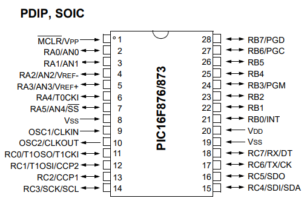

# Quick Guide for PIC16F87x
## Reference of the PIC16 Used – MICROCHIP
- PIC16F87x (Includes PIC16F873, PIC16F873A, PIC16F874, PIC16F874A, PIC16F876, PIC16F876A, PIC16F877 and PIC16F877A)

**NOTE:** This guide does NOT include the **complete datasheet**, it only presents the essential information necessary for configuring the microcontroller, the use of its pins, the **ADC**, the main peripherals and the most important initial parameters for its implementation.

## Pin Naming Convention
Pin names consist of a letter indicating the port and a number indicating the pin. For example, `b6` indicates pin 6 of port `b`. All names in **Aixt** are written in lowercase, to comply with [V variable naming rules.](https://github.com/vlang/v/blob/master/doc/docs.md#variables).

| Category | Parameter | Common value for PIC16F87x |
------------------- | --------------------------- | ---------------------------------------- |
**Architecture** | Core | 8-bit – RISC Mid-Range |
| Instruction Set | 35 instructions |
| Instruction Cycle | Fosc / 4 |
| Stack | 8 levels |
**Voltage** | Operating Voltage (VDD) | 2.0 – 5.5 V |
| Maximum Voltage per Pin | -0.3 V to VDD + 0.3 V |
**Current** | Maximum Current per Pin | 25 mA |
| Total Current per Port | ≤ 200 mA |
**Frequency** | Maximum Clock Frequency | 20 MHz |
**Memory** | Flash Architecture | 14-bit words |
| RAM Organization | Banked RAM |
| | EEPROM | Integrated, byte-by-byte access |
**I/O Ports** | Available Ports | PORTA, PORTB, PORTC |
| | Pin Configuration | **TRISx** Registers |
| | Digital Read/Write | **PORTx** Registers |
| | External Interrupt | RB0 / INT |
| | Change Interrupt | RB4–RB7 |
**ADC** | Resolution | **10 bits** |
| | Type | SAR |
| | References | VDD/VSS or external |
| | Result Justification | Left or right |
**Timeres** | Timer0 | 8 bits, prescaler 1:2–1:256 |
| | Timer1 | 16 bits, internal or external clock |
| | Timer2 | 8 bits, base for PWM |
| **PWM (CCP)** | Available Modules | CCP1 and CCP2 |
| PWM Resolution | Up to 10 bits |
| PWM Clock Source | Timer2 |
| **Communication** | USART | Full duplex, synchronous/asynchronous |
| SPI / I²C | MSSP Master / Slave |
| **Interrupts** | Supported Sources | INT, IOC PORTB, ADC, Timers, USART, MSSP |
| **Oscillator** | Internal Oscillator | None |
| Supported Modes | LP / XT / HS / EC |
| Clock Pins | RA7 (CLKIN) / RA6 (CLKOUT) |
| **Reset and Control** | Power-On Reset (POR) | Applicable |
| Brown-Out Reset (BOR) | Applicable |
| Watchdog Timer (WDT) | Applies |
| External Reset | MCLR |
Programming | Method | ICSP® |
Current Consumption | Sleep Mode | µA |
MCLR | Recommended Resistance | 10 kΩ pull-up |

| Parameter / Characteristic | 873 | 873A | 874 | 874A | 876 | 876A | 877 | 877A |
--------------------------------- | :-: | :--: | :-: | :--: | :-: | :--: | :--: | :--: |
**8-bit RISC Architecture** | Applies | Applies | Applies | Applies | Applies | Applies | Applies | Applies |
**35 Instructions** | Applies | Applies | Applies | Applies | Applies | Applies | Applies |
**Voltage 2.0–5.5 V** | Applies | Applies | Applies | Applies | Applies | Applies | Applies |
**Maximum Frequency 20 MHz** | Applies | Applies | Applies | Applies | Applies | Applies | Applies | Applies |
**Internal Oscillator** | Not Applicable | Not Applicable | Not Applicable | Not Applicable | Not Applicable | Not Applicable | Not Applicable | Not Applicable |
**PORTA, PORTB, PORTC** | Applies | Applies | Applies | Applies | Applies | Applies | Applies | Applies |
**Interrupt RB0 / INT** | Applies | Applies | Applies | Applies | Applies | Applies | Applies | Applies |
**IOC RB4–RB7** | Applies | Applies | Applies | Applies | Applies | Applies | Applies |
**10-bit ADC** | Applies | Applies | Applies | Applies | Applies | Applies | Applies |
**ADC up to 5 channels (AN0–AN4)** | Applies | Applies | Applies | Applies | Not Applicable | Not Applicable | Not Applicable | Not Applicable |
**ADC up to 8 channels (AN0–AN7)** | Not Applicable | Not Applicable | Not Applicable | Not Applicable | Applicable | Applicable | Applicable | Applicable |
**Timer0 (8-bit)** | Applicable | Applicable | Applicable | Applicable | Applicable | Applicable | Applicable | Applicable | Applicable |
**Timer1 (16-bit)** | Applicable | Applicable | Applicable | Applicable | Applicable | Applicable | Applicable | Applicable | Applicable |
**Timer2 (8-bit)** | Applicable | Applicable | Applicable | Applicable | Applicable | Applicable | Applicable | Applicable | Applicable |
**Timer3 (16-bit)** | Not Applicable | Not Applicable | Not Applicable | Not Applicable | Applicable | Applicable | Applicable | Applicable |
**PWM CCP1 (RC2)** | Applicable | Applicable | Applicable | Applicable | Applicable | Applicable | Applicable | Apply | Apply |
| **PWM CCP2 (RC1)** | Apply | Apply | Apply | Apply | Apply | Apply | Apply | Apply |
| **USART (RC6/RC7)** | Apply | Apply | Apply | Apply | Apply | Apply | Apply | Apply |
| **SPI / I²C (MSSP)** | Apply | Apply | Apply | Apply | Apply | Apply | Apply | Apply |
| **Internal comparators** | Not Applicable | Not Applicable | Not Applicable | Apply | Not Applicable | Not Applicable | Not Applicable | Apply |
| **Internal EEPROM** | Apply | Apply | Apply | Apply | Apply | Apply | Apply | Apply |
| **ICSP®** | Apply | Apply | Apply | Apply | Apply | Apply | Apply | Apply |
| **Watchdog Timer (WDT)** | Applies | Applies | Applies | Applies | Applies | Applies | Applies | Applies |
**Brown-Out Reset (BOR)** | Applies | Applies | Applies | Applies | Applies | Applies | Applies | Applies |
**Sleep Mode** | Applies | Applies | Applies | Applies | Applies | Applies | Applies | Applies |


 Source: (https://ww1.microchip.com/downloads/en/devicedoc/30292d.pdf)

 Source: (https://ww1.microchip.com/downloads/en/devicedoc/39582b.pdf)

### PIC16F87x Pin Names

The microcontroller's pins can function as digital inputs or outputs, analog inputs for the ADC, or perform special functions such as PWM, UART, interrupts, comparators, and clock. Understanding their names allows for correct configuration and avoids conflicts between digital and analog functions.

| Port | 0 | 1 | 2 | 3 | 4 | 5 | 6 | 7 |
| :----: | ---- | ---- | ---- | ---- | ---- | ---- | ---- | ---- |
| **A** | `a0` | `a1` | `a2` | `a3` | `a4` | `a5` | - | - |
| **B** | `b0` | `b1` | `b2` | `b3` | `b4` | `b5` | `b6` | `b7` |
| **C** | `c0` | `c1` | `c2` | `c3` | `c4` | `c5` | `c6` | `c7` |

For the PIC16F876/877 (33 pins), extra pins are added to port C, corresponding to:

| Port | 0 | 1 | 2 | 3 | 4 | 5 | 6 | 7 | 8 |
:----: | ---- | ---- | ---- | ---- | ---- | ---- | ---- | ---- | ---- |
**A** | `a0` | `a1` | `a2` | `a3` | `a4` | `a5` | - | - | - |
**B** | `b0` | `b1` | `b2` | `b3` | `b4` | `b5` | `b6` | `b7` | - |
**C** | `c0` | `c1` | `c2` | `c3` | `c4` | `c5` | `c6` | `c7` | `c8` |

## Special Functions

| Function | PIC16F873/873A/874/874A | PIC16F876/876A/877/877A | Assigned Pins |
----------------------------------- | ----------------------- | ----------------------- | -------------------------------- |
**ADC (AN0–AN4)** | 5 channels | 8 channels (AN0–AN7) | A0–A5 (873/874), A0–A7 (876/877) |
**PWM CCP1** | 1 module | 1 module | C2 |
**PWM CCP2** | 1 module | 1 module | C1 |
**UART TX/RX** | 1 module | 1 module | C6 / C7 |
**External Interrupt INT** | 1 pin | 1 pin | B0 |
**I²C SDA/SCL** | Integrated MSSP | Integrated MSSP | C4/C3 |
| **SPI (MOSI/MISO/SCK)** | Integrated MSSP | Integrated MSSP | C3/C4/C5 |
| **Timer0** | 8 bits | 8 bits | Internal / RA4/T0CKI |
| **Timer1** | 16 bit | 16 bit | Internal / T1CKI |
| **Timer2** | 8 bits | 8 bits | Internal (for PWM) |
| **Timer3** | Not available | 16 bit | T3CKI (876/877) |
| **Internal comparators** | No | Some models A | AN0/AN1 (874A/877A) |
| **External oscillator (CLKIN/CLKOUT)** | All models | All models | RA6/RA7 |
| **External reset (MCLR)** | All | All | MCLR pin |
| **Watchdog (WDT)** | All | All | Integrated |
| **Port Change Interrupt** | B4–B7 | B4–B7 | PORTB |

## General Specifications

| Category | Specification |
------------------------ | -------------------------------------------------- |
**Architecture** | 8-bit, Mid-Range RISC core (35 instructions) |
**Flash** | 4K words |
**RAM** | 192 bytes |
**EEPROM** | 128 bytes |
**I/O Ports** | 22 digital pins |
**ADC Channels** | 5 channels (AN0–AN4), 10-bit resolution |
**Comparators** | No integrated comparator. Not available in standard versions. Available (2) only in A versions, **PIC16F874A/877A**. |
**PWM** | CCP1 and CCP2 |
**Timers** | TMR0 (8-bit), TMR1 (16-bit), TMR2 (8-bit) |
**USART** | TX/RX on RC6/RC7 |
**I²C / SPI** | Integrated MSSP |
**Operating Voltage** | 2.0 – 5.5 V |
**Internal Oscillator** | None (requires crystal or external oscillator) |
**Interrupts** | INT, PORTB IOC, ADC, TMR0, TMR1, TMR2, USART, MSSP |
**Programming** | ICSP® |

## Differences within the family

| Feature | Relevant differences |
---------------------- | ---------------------------------------------------------------------------------------------------- |
**Flash Memory** | 873/873A: 4 KB, 874/874A: 4 KB, 876/876A/877/877A: 8 KB |
**Number of Pins** | 873/873A/874/874A: 28 pins, 876/876A/877/877A: 40 pins (33 effective I/O) |
**ADC** | All have 10-bit ADCs, but the 876/877 has up to 8 channels (AN0–AN7) |
**PWM (CCP)** | 873/874: 2 modules, 876/877: 2 modules; some versions support PWM on more pins |
**USART / MSSP** | The 876/877 supports SPI/I²C master/slave on the same pins, but the TRIS configuration may vary |
**Timers** | The 876/877 has an additional Timer3 (16-bit), absent in the 873/874 |
**Internal Comparator** | Some versions (874A, 877A) include comparators on certain pins |
**Oscillator** | All require an external oscillator, but the modes and CLKOUT/CLKIN pins may vary slightly |

## General Configuration

```V
import pin
import port
import adc
import time

pin.setup(pin.b0, pin.output)
pin.setup(pin.a1, pin.input)
pin.setup(pin.c2, pin.output)
pin.setup(pin.c7, pin.input)
pin.setup(pin.a5, pin.output)

port.setup(port.b, 0b00000000) // Port B as output
port.setup(port.c, 0b11000000) // RC6/RC7 UART inputs

adc.setup()
adc.read(0) // AN0 as first read
```

## Electrical Limits

| Parameter | Value/Range | Description |
| ------------------------ | ------------------ | ----------------------- |
| Operating voltage | **2.0–5.5 V** | Normal Range |
| Maximum Voltage per Pin | −0.3 to VDD + 0.3 V | Absolute Limit |
| Maximum Current per Pin | **25 mA** | Do Not Exceed |
| Current per Port | **200 mA Total** | Sum of all pins |
| Maximum Frequency | **20 MHz** | For External Crystal |
| Sleep Current | µA | Ultra Low Power Consumption |
| MCLR Resistor | 10 kΩ | Recommended Pull-Up |

## Key Registers

| Register | Function | Use |
| ------------------ | ------------------ | --------------------------- |
**TRISx** | Pin Address | 1=input, 0=output |
**PORTx** | Port Status | Digital Read/Write |
**ADCON0** | ADC Control | Channel, Conversion Start |
**ADCON1** | ADC Config | References, Justified |
**CCP1/CCP2** | PWM | Duty Cycle Control |
**TXSTA/RCSTA** | UART | TX/RX Control |
**SSPCON/SSPSTAT** | I²C/SPI | MSSP Config |

## Timers

| **Timer** | **Resolution** | **Clock Source** | **Main Features** |
|----------|----------------|------------------------------------|----------------------------------------------------|
**Timer0** | 8 bits | Internal or RA4/T0CKI | Prescaler 1:2 to 1:256 |
**Timer1** | 16 bits | Internal or external (T1CKI) | Ideal for precise timing |
**Timer2** | 8 bits | Internal | Automatically controls PWM (CCP module) |

## Interrupts

| Register | Function |
| ----------------------- | --------------------------------- |
**INTCON** | GIE, PEIE, T0IE, INTE, RBIE |
**PIE1 / PIR1** | ADC, TMR1, TMR2, USART, PSP |
**PIE2 / PIR2** | MSSP, comparator |
**RBIF (PORTB change)** | Interrupt on change in RB4–RB7 |

## Oscillator (Does not have an internal oscillator)

| Mode | Description |
| ---------------- | ----------------- |
**XT / HS / LP** | Requires oscillator |
**EC** | External power supply |
**CLKOUT (RA6)** | Clock output |
**CLKIN (RA7)** | Clock input |

## Reset and WDT Modes

| Mode | Description |
| --------- | --------------------- |
**POR** | Power-on reset |
**MCLR** | External reset |
**BOR** | Low voltage reset |
**WDT** | Watchdog timer reset |
**SLEEP** | Low power mode |

## Simple Example: Pin Usage

```v
pin.high(pin.b1)
pin.low(pin.c2)

val := pin.read(pin.a0)

pin.write(pin.b0, pin.read(pin.c7))
```

## ADC Example

```v
adc_val := adc.read(0)

if adc_val > 512 {
pin.high(pin.c2)
} else {
pin.low(pin.c2)
}
```

## Time Example

```v
time.sleep_ms(500)
```

In the PIC16 microcontroller family, port registers are divided into:

- `TRIS` To configure each port pin
- `PORT` To manage pins as inputs or outputs

Then, to facilitate implementation (and avoid generating code) (Unnecessary) of this port _Aixt_, the name of each pin differs depending on its configuration, input, and output, as in the following example:

- `b5_s` Bit name to configure the `b5` pin as input or output
- `b5` Bit name to read the `b5` pin as input or output

### Integrated Components

- It has five analog pins distributed across port A.

| Port | 0 | 1 | 2 | 3 | 4 | 5 | 6 | 7 |
:----: | --- | --- | --- | --- | --- | - | - | - |
**A** | AN0 | AN1 | AN2 | AN3 | AN4 | – | – | – |
**B** | – | – | – | – | – | – | – | – |
**C** | – | – | – | – | – | – | – | – |

- It has two pins for PWM modulation.

| Port | 0 | 1 | 2 | 3 | 4 | 5 | 6 | 7 |
:----: | --- | --- | --- | --- | --- | --- | --- | --- |
**A** | - | - | - | - | - | - | - | - |
**B** | - | - | - | - | - | - | - | - |
**C** | - | CCP2 (c1) | CCP1 (c2) | - | - | - | - | - |

- It has two pins for serial communication (UART).

| Port | 0 | 1 | 2 | 3 | 4 | 5 | 6 | 7 |
:----: | --- | --- | --- | --- | --- | --- | --- | --- |
**A** | - | - | - | - | - | - | - | - |
**B** | - | - | - | - | - | - | - | - |
**C** | - | - | - | - | - | - | c6 (TX) | c7 (RX) |

### Supported Functions

The Aixt API provides functions for handling digital inputs/outputs, full ports, the ADC converter, PWM modulation, UART serial communication, and timing.

| Function | Description |
| ---------------------------- | --------------------------------------------------------------------------------- |
`pin.setup(pin_name, mode)` | Configures a pin as an input (`pin.input`) or output (`pin.output`). |
`pin.high(pin_name)` | Sets the pin to a high level (1). |
`pin.low(pin_name)` | Sets the pin to a low level (0). |
`pin.write(pin_name, value)` | Writes a digital value (0/1) to a pin. |
`pin.read(pin_name)` | Reads the digital state of a pin. |
`pin.digital()` | Sets **all pins** to digital mode (disables analog functions). |

### Examples of the different API functions in the _Aixt_v language

## Time

```v

time.sleep(5) // 5-second delay
time.sleep_us(10) // 10-microsecond delay
time.sleep_ms(500) // 500-millisecond delay
```

## Pin configuration

```v
pin.setup(pin.a5, pin.output) // A5 as output
pin.setup(pin.b7, pin.output) // B7 as output
pin.setup(pin.a0, pin.input) // A0 as input
pin.setup(pin.c4, pin.input) // C4 as input

pin.high(pin.a5) // Turn A5 on
pin.low(pin.a5) // Turn A5 off

pin.write(pin.a2, 0) // Write 0 to A2
pin.write(pin.a2, 1) // Write 1 to A2

pin.read(pin.b4) // Read B4
pin.read(pin.c7) // Read C7
```

Example of turning an LED on and off:

```v
for {
pin.high(pin.c7)
time.sleep_us(500)
pin.low(pin.c7)
time.sleep_us(500)
}
```
Example of turning an LED on and off with a digital input:

```v
pin.digital() // Forces all pins to digital mode

for {
if b4 == 1 { // If pin B4 is high
pin.high(pin.a4)
pin.high(pin.a5)

}
else if b5 == 1 { // If pin B5 is low high 
pin.low(pin.a4) 
pin.low(pin.a5) 
}
}
```

## Port Configuration

```v
port.setup(port.b, 0b00000000) // Set the entire port B as an output
```

Example of turning the microcontroller port on and off:

```v

for {
port.write(port.b, 0b01010101)
time.sleep_ms(500)
port.write(port.b, 0b10101010)
time.sleep_ms(500)
}
```

## ADC Configuration

```v
adc.setup() // Initialize the ADC
adc.read(0) // Read AN0
```

Example of turning LEDs on and off depending on the ADC value:

```v
unsigned int adc_result // Variable to store the reading

for {
adc_result = adc.read(0) 

if adc_result >= 1020 { 
pin.high(pin.b0) 
pin.high(pin.b1) 
pin.high(pin.b2) 
} 
else if adc_result >= 820 { 
pin.high(pin.b0) 
pin.high(pin.b1) 
pin.low(pin.b2) 
} 
else if adc_result >= 620 { 
pin.high(pin.b0) 
pin.low(pin.b1) 
pin.low(pin.b2) 
} 
else { 
pin.low(pin.b0) 
pin.low(pin.b1) 
pin.low(pin.b2) 
}
}
```

## PWM Configuration

```v
pwm.setup() // Initializes PWM
pwm.write(512) // Duty of 50% (example)
```
Example of varying the intensity of an LED:
```v

for {
adc_value := adc.read(0) // Read AN0
pwm.write(adc_value) // Apply to PWM (0–1023)
}
```

## UART Configuration Transmission

```v
uart.setup() // Initializes UART
```
Example of sending a character and displaying it in a message:

```v

for {
uart.write(0x33)
time.sleep_ms(500)
uart.write(0x99)
time.sleep_ms(500)
}
```

## UART Configuration Reception

```v
uart.setup() // Initializes UART
port.setup(port.b, 0x00) // Port B as output
pin.setup(pin.c7, pin.input) // RX on C7
```
Example of writing to PORTB what arrives via UART:

```v
for {
value := uart.read() // Read received byte
port.write(port.b, value) // Send directly to port B
}
```