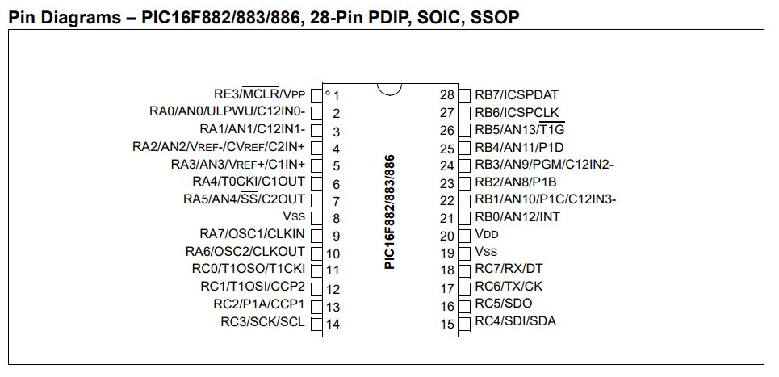

# Guia Rápida para PIC16F886
## Referencia del PIC16 utilizado de la marca MICROCHIP
- PIC16F886  

**NOTA:** Este microcontrolador PIC16F cuenta con salidas digitales, entradas digitales, ADC, PWM y comunicación serial.

## Nombres de los Pines
Los nombres de los pines se nombran con una letra que indica el puerto y un número que indica el pin. Por ejemplo `a6` indica el pin 6 del puerto A. Todos los nombres en **Aixt** estan escritos en minúsculas, para seguir [V variable naming rules.] (https://github.com/vlang/v/blob/master/doc/docs.md#variables).

### Nombres de los pines del PIC16F886
| Puerto | 0 | 1 | 2 | 3 | 4 | 5 | 6 | 7 |
|:------:|---|---|---|---|---|---|---|---|
| **A**  | a0| a1| a2| a3| a4| a5| a6| a7|
| **B**  | b0| b1| b2| b3| b4| b5| b6| b7|
| **C**  | c0| c1| c2| c3| c4| c5| c6| c7|
| **E**  | - | - | - | e3| - | - | - | - |

 (https://ww1.microchip.com/downloads/aemDocuments/documents/OTH/ProductDocuments/DataSheets/40001291H.pdf)

`MCLR` significa Master Clear/Reset, es decir, un pin de reinicio del controlador y se conecta a Vcc (+5 V).
- `VDD` Alimentación positiva y referencia de tierra para los pines lógicos y de E/S, respectivamente. Estos pines cuentan con protección de diodo.
- `VSS` significa Fuente de Voltaje, Fuente o Fuente de Suministro de Voltaje y es el pin de tierra (GND), también conocido como referencia de voltaje, 0 voltios para todo el circuito.

En las familias de microcontroladores del _PIC16_, los registros del puerto se dividen en: 

- `TRIS` Para configurar cada pin del puerto
- `PORT` Para gestionar los pines como entradas o salidas

Tiene un pin de entrada y ocho de salida al dispositivo digital, el cual recibe el valor converdido del circuito analógico para mostrar el comportamiento ciclico programado de encendido del LED.

| Port | 0   | 1   | 2   | 3   | 4   | 5   | 6   | 7   |
|:----:|-----|-----|-----|-----|-----|-----|-----|-----|
| **A**| `a0`| ----| ----| ----| ----|----|----|----|
| **B**| `b0`| `b1`| `b2`| `b3`| `b4`| `b5`| `b6`| `b7`|


### Componentes Integrados 
- Cuenta con 24 pines analogos-digitales que se encuentran entre `A0–A7` Entradas/salidas; `B0–B7`, son salidas digitales, que se encuentran conectadas a datos; `C0–C7`, son pines entradas/salidas adicionales y pueden ser programados de forma especial, con funciones especificas; `Vdd` y ``ss`, son alimentación de 0V a 5V y GND; y finalizamos con el pin `MCLR/Vpp`, el cual es el reset, configurado de forma externa.


### Funciones soportadas
Las funciones que contiene la API entradas o salidas digitales, conversor analogico a digital, modulación pwm y comunicación serial.

#### Entradas y Salidas Digitales (GPIO)
Nombre                                | Descripcion
------------------------------------|------------------------------------------------------
`pinMode(pin, modo)`   | Configura un pin como entrada o salida digital.
`digitalWrite(pin, valor)`               | Envía un nivel lógico alto o bajo (1 o 0) a un pin configurado como salida.
`digitalRead(pin)`                | Lee el estado lógico (1 o 0) de un pin configurado como entrada.
`portWrite(puerto, valor)`          | Envía un valor binario (0–255) a un puerto completo (ej. PORTB).
`portRead(puerto)`               | Lee el valor binario presente en un puerto completo.

```v
import port //Configuracion

// Configurar RB0 como salida y RB1 como entrada
port.setup(port.b0, port.output)
port.setup(port.b1, port.input)

for {
    if port.read(port.b1) == 1 {      // Si la entrada RB1 está en alto
        port.write(port.b0, 1)       // Encender salida RB0
    } else {
        port.write(port.b0, 0)       // Apagar salida RB0
    }
}
```

#### Conversor Analógico a Digital (ADC)
Nombre                                | Descripcion
------------------------------------|------------------------------------------------------
`adcInit(canal)`                 | Inicializa el ADC y selecciona el canal analógico a leer.
`adcRead(canal)`                         | Realiza la conversión y devuelve el valor digital (0–1023 para 10 bits).

```v
import adc //Configuracion
import port
import time

adc.setup(0) // Canal AN0

for {
    value := adc.read(0)  // Leer valor ADC (0-1023)
    port.write(port.b, value >> 2)  // Escalar a 8 bits y mostrar en PORTB
    time.sleep_ms(100)
}
```

#### Modulación por Ancho de Pulso (PWM)
Nombre                                | Descripcion
------------------------------------|------------------------------------------------------
`pwmWrite(canal, ciclo`     | Ajusta el ciclo de trabajo (duty cycle) entre 0 y 1023 (para 10 bits).
`pwmInit(canal, frecuencia`                      |Configura un canal PWM con la frecuencia deseada. 
`pwmStop(canal)`                | Detiene la generación de señal PWM en el canal especificado.

```v
import pwm //configuracion
import time

pwm.setup(1, 500) // Canal 1, frecuencia 500 Hz

for duty := 0; duty < 1024; duty += 10 {
    pwm.write(1, duty)     // Ajustar ciclo de trabajo (0-1023)
    time.sleep_ms(10)
}
```

#### Comunicación Serial (USART)
Nombre                                | Descripcion
------------------------------------|------------------------------------------------------
`serialBegin(baudrate`                               | Inicializa la comunicación serial con la velocidad indicada (por ejemplo, 9600 bps).
`serialWrite(dato)`                      | Envía un byte de datos por el puerto serial.
`serialRead()`                  | Lee un byte de datos recibido por el puerto serial. 
`serialAvailable()`                               | Indica si hay datos disponibles para leer.


```v
import serial //Configuracion
import time

serial.begin(9600) // Velocidad de comunicación 9600 bps

for {
    serial.write("Hola PIC16F886!\n")
    time.sleep_ms(1000)
}
```

### Ejemplo de las funciones de la API en lenguaje _Aixt_v 

```v

#include <xc.h>
#include <stdio.h>
#include <stdbool.h>
#include <stdint.h>
#define _XTAL_FREQ 10000000
#pragma config FOSC = HS        // Oscillator Selection bits (HS oscillator: High-speed crystal/resonator on RA6/OSC2/CLKOUT and RA7/OSC1/CLKIN)
#pragma config WDTE = OFF       // Watchdog Timer Enable bit (WDT disabled and can be enabled by SWDTEN bit of the WDTCON register)
#pragma config PWRTE = OFF      // Power-up Timer Enable bit (PWRT disabled)
#pragma config MCLRE = OFF      // RE3/MCLR pin function select bit (RE3/MCLR pin function is digital input, MCLR internally tied to VDD)
#pragma config CP = OFF         // Code Protection bit (Program memory code protection is disabled)
#pragma config CPD = OFF        // Data Code Protection bit (Data memory code protection is disabled)
#pragma config BOREN = OFF      // Brown Out Reset Selection bits (BOR disabled)
#pragma config IESO = OFF       // Internal External Switchover bit (Internal/External Switchover mode is disabled)
#pragma config FCMEN = OFF      // Fail-Safe Clock Monitor Enabled bit (Fail-Safe Clock Monitor is disabled)
#pragma config LVP = OFF		// Low Voltage Programming Enable bit (RB3/PGM pin has PGM function, low voltage programming enabled)
#pragma config BOR4V = BOR40V   // Brown-out Reset Selection bit (Brown-out Reset set to 4.0V)
#pragma config WRT = OFF        // Flash Program Memory Self Write Enable bits (Write protection off)
#define time__sleep_ms(TIME)    __delay_ms(TIME)  // implementing by a macro for saving memory
#define time__sleep_us(TIME)    __delay_us(TIME)  // implementing by a macro for saving memory
#define time__sleep(TIME)    __delay_ms(TIME*1024)  // implementing by a macro for saving memory
#define pin__output 0	// pin mode direction
#define pin__input  1
#define pin__a0      A, 0	// pin names
#define pin__a1      A, 1
#define pin__a2      A, 2
#define pin__a3      A, 3
#define pin__a4      A, 4
#define pin__a5      A, 5
#define pin__a6      A, 6
#define pin__a7      A, 7
#define pin__b0      B, 0
#define pin__b1      B, 1
#define pin__b2      B, 2
#define pin__b3      B, 3
#define pin__b4      B, 4
#define pin__b5      B, 5
#define pin__b6      B, 6
#define pin__b7      B, 7
#define pin__c0      C, 0
#define pin__c1      C, 1
#define pin__c2      C, 2
#define pin__c3      C, 3
#define pin__c4      C, 4
#define pin__c5      C, 5
#define pin__c6      C, 6
#define pin__c7      C, 7
#define pin__e3      E, 3
#define pin__write_(PORT_NAME, PIN, VALUE)   PORT ## PORT_NAME ## bits.R ## PORT_NAME ## PIN = VALUE
#define pin__write(PIN_NAME, VALUE)  pin__write_(PIN_NAME, VALUE)
#define pin__high_(PORT_NAME, PIN)   PORT ## PORT_NAME ## bits.R ## PORT_NAME ## PIN = 1
#define pin__high(PIN_NAME)  pin__high_(PIN_NAME)
#define pin__setup_(PORT_NAME, PIN, MODE)   TRIS ## PORT_NAME ## bits.TRIS ## PORT_NAME ## PIN = MODE
#define pin__setup(PIN_NAME, PIN_MODE)  pin__setup_(PIN_NAME, PIN_MODE)
#define pin__toggle_(PORT_NAME, PIN)   PORT ## PORT_NAME ## bits.R ## PORT_NAME ## PIN ^= 1
#define pin__toggle(PIN_NAME)  pin__toggle_(PIN_NAME)
#define pin__read_(PORT_NAME, PIN)	PORT ## PORT_NAME ## bits.R ## PORT_NAME ## PIN
#define pin__read(PIN_NAME)  pin__read_(PIN_NAME)
#define pin__low_(PORT_NAME, PIN)   PORT ## PORT_NAME ## bits.R ## PORT_NAME ## PIN = 0
#define pin__low(PIN_NAME)  pin__low_(PIN_NAME)
#define port__a		A	// port name constants
#define port__b		B
#define port__c		C
#define port__e		E
#define	port__all_inputs	0xFF	// port mode constants
#define	port__all_outputs	0x00
#define TRISport__a		TRISA	// port setup name equivalents
#define TRISport__b		TRISB
#define TRISport__c		TRISC
#define TRISport__e		TRISE
#define PORTport__a		PORTA	// port name equivalents
#define PORTport__b		PORTB
#define PORTport__c		PORTC
#define PORTport__e		PORTE
#define port__write(PORT_NAME, VALUE)  PORT ## PORT_NAME = (uint8_t)VALUE
#define port__setup(PORT_NAME, VALUE)   TRIS ## PORT_NAME = VALUE
#define port__read(PORT_NAME)  PORT ## PORT_NAME
#define	adc__in0 	0b1111111111111110
#define	adc__in1 	0b1111111111111101
#define	adc__in2 	0b1111111111111011
#define	adc__in3 	0b1111111111110111
#define	adc__in4 	0b1111111111101111
#define	adc__in5 	0b1111111111011111
#define	adc__in6 	0b1111111110111111
#define	adc__in7 	0b1111111101111111
#define	adc__in8 	0b1111111011111111
#define	adc__in9 	0b1111110111111111
#define	adc__in10	0b1111101111111111
#define adc__f_30ksps_1mhz	0	// VREF 3.0v
#define adc__f_30ksps_4mhz	1	// VREF 3.0v
#define adc__f_18ksps_8mhz	2	// VREF full range
#define adc__f_21ksps_10mhz	2	// VREF full range
#define adc__f_24ksps_12mhz	2	// VREF 3.0v
#define adc__f_30ksps_16mhz	2	// VREF 3.0v
#define adc__f_34ksps_20mhz	2	// VREF 3.0v
#define adc__f_18ksps_irc	3	// sleep mode FOSC > 1Mhz
#define	adc__bits_8		0
#define	adc__bits_10	1
#define	adc__ch0 	0
#define	adc__ch1 	1
#define	adc__ch2 	2
#define	adc__ch3 	3
#define	adc__ch4 	4
#define	adc__ch5 	5
#define	adc__ch6 	6
#define	adc__ch7 	7
#define	adc__ch8 	8
#define	adc__ch9 	9
#define	adc__ch10	10

uint8_t adc__read_byte(uint8_t channel) ;
uint16_t adc__read(uint8_t channel) ;


uint8_t adc__read_byte(uint8_t channel) {    
    ADCON0bits.CHS = channel;   /* assign the ADC channel */    
    ADCON0bits.GO_DONE = 1;     /* start conversion */  
    while(ADCON0bits.GO_DONE == 1) {}   /* wait for the end of conversion */    
    return ADRESH;              /* return the ADC value (8 bits) */  
}


#define adc__setup(PINS, FAD, NBITS) \
    /* analog pins setup */ \
    ANSEL = (uint8_t)~PINS;         \
    ANSELH = (uint8_t)(~PINS>>8);   \
    /* ADC setup */ \
    ADCON1 = 0b00000000;    /*VSS, VDD*/\
    ADCON1bits.ADFM = NBITS;    \
    ADCON0bits.ADCS = FAD;  \
    ADCON0bits.ADON = 1;


uint16_t adc__read(uint8_t channel) {    
    ADCON0bits.CHS = channel;   /* assign the ADC channel */    
    ADCON0bits.GO_DONE = 1;     /* start conversion */  
    while(ADCON0bits.GO_DONE == 1) {}   /* wait for the end of conversion */    
    return (ADRESH << 8) | ADRESL;     /* return the ADC value */  
}


void main(void) {

pin__setup(pin__a0, pin__input);
adc__setup(adc__in0, adc__f_21ksps_10mhz, adc__bits_8);
port__setup(port__b, port__all_outputs);
unsigned char muestra = 0;
while(true) {
muestra = adc__read_byte(adc__ch0);
port__write(port__b, muestra);
}
}

```

## Configuración de un pin individual 

```v

import port

// Configurar RB0 como salida
port.setup(port.b0, port.output)

// Configurar RB1 como entrada
port.setup(port.b1, port.input)
```
## Configuración de un Puerto Completo

```v
import port

// Configurar todos los pines del puerto B como salidas
port.setup(port.b, port.all_outputs)

```
## Configuración Combinada de Bits

```v
import port

// 1 = salida, 0 = entrada
// Ejemplo: 0b11110000 -> RB7..RB4 salidas, RB3..RB0 entradas
port.setup_mask(port.b, 0b11110000)

```