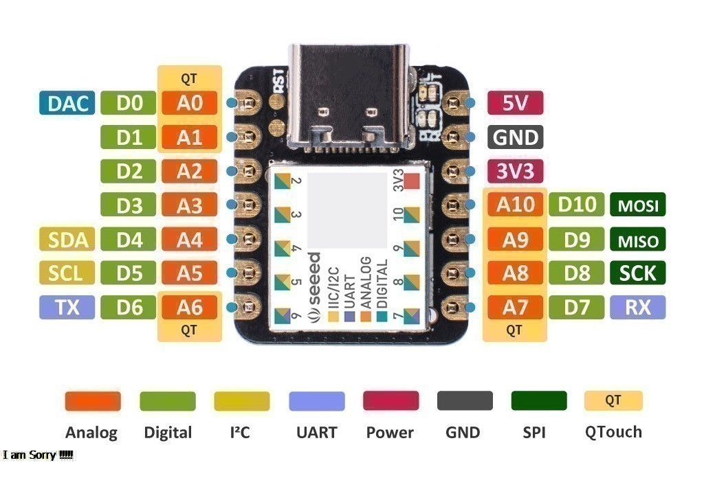

# **Quick Guide Seeeduino Xiao**

This is an Aixt implementation to provide support for the SAMD21 board.

## Summary
* SAMD21 has 14 pins, which can be used for 11 digital interfaces, 11 simulated interfaces, 10 PWM interfaces (d1-d10), 1 DAC output pin D0, 1 SWD pad interface, 1 I2C interface, 1 SPI interface, 1 UART interface, Serial communication indicator (T/R), Flashing light (L) through pin multiplexing. The LED colors (Power, L, RX, TX) are green, yellow, blue, and blue. Additionally, Seeed Studio XIAO SAMD21 has a Type-C interface that can supply power and download code. There are two reset buttons, you can briefly connect them to reset the board. The pin definition is described in the* Pin Identification table.



***Getting Started with Seeed Studio XIAO SAMD21." (n.d.). Retrieved February 17, 2024, from: https://wiki.seeedstudio.com/Seeeduino-XIAO/

## Datasheet
[Seeeduino Xiao SAMD21G18A-MU](https://files.seeedstudio.com/wiki/XIAOSeeed-Studio-XIAO-Series-SOM-Datasheet.pdf) 

## Pin Identification

| Pin No. | Name                 | Function |
|---------|----------------------|----------|
| 0       | D0-A0-DAC-QT0        | Analog; Digital; Analog to Digital Converter; Capacitive touch button integrated circuit |
| 1       | D1-A1-QT1            | Analog; Digital; Capacitive touch button integrated circuit |
| 2       | D2-A2                | Analog; Digital |
| 3       | D3-A3                | Analog; Digital |
| 4       | D4-A4-SDA(I2C)       | Analog; Digital; Inter-Integrated Circuit (I2C) Protocol (Data Transmission) |
| 5       | D5-A5-SCL(I2C)       | Analog; Digital; Inter-Integrated Circuit (I2C) Protocol (Clock Synchronization) |
| 6       | D6-A6-TX-QT2         | Analog; Digital; Serial Communication (Transmitter); Capacitive touch button integrated circuit |
| 7       | D7-A7-RX-QT3         | Analog; Digital; Serial Communication (Receiver); Capacitive touch button integrated circuit |
| 8       | D8-A8-SCK(SPI)-QT4   | Analog; Digital; Serial Clock; Capacitive touch button integrated circuit |
| 9       | D9-A9-MISO(SPI)-QT5  | Analog; Digital; 4-Wire Communication Protocol; Capacitive touch button integrated circuit |
| 10      | D10-A10-MOSI(SPI)-QT6| Analog; Digital; 4-Wire Communication Protocol; Capacitive touch button integrated circuit |
| 11      | 3.3V                 | Microcontroller Power Supply |
| 12      | GND                  | Ground |
| 13      | 5V                   | Board Power Supply |


## Programming in V Language

The functions contained in the API for digital input or output and for performing analog to digital conversion.

| Name                    | Description                                    | Examples                                 |
|-------------------------|------------------------------------------------|------------------------------------------|
| `pin.setup(pin, mode)`  | Configure `pin` as `mode` (input, out)         | **pin.setup**(5, pin.input) // Set pin 5 as input |
| `pin.output`            | Parameter `mode` output configuration          | pin.setup(3, **pin.output**) // Set pin 3 as output |
| `pin.input`             | Parameter `mode` input configuration           | pin.setup(7, **pin.input**) // Set pin 7 as input |
| `pin.high(pin)`         | Digital output high `pin`                      | **pin.high**(3) // Output high on pin 3 |
| `pin.low(pin)`          | Digital output low `pin`                       | **pin.low**(3) // Output low on pin 3 |
| `pin.write(pin, val)`   | Write `val` to `pin`                           | **pin.write**(3, 1) // Write 1 to pin 3 |
| `pin.read(pin)`         | Digital read `pin`                             | val=**pin.read**(3) // Read pin 3 and store in val |
| `adc.read(pin)`         | Analog read `pin` for `adc`                    | val=**adc.read**(3) // Read analog value of pin 3 and store in val |
| `pwm.write(pin, val)`   | PWM output `pin` with duty cycle `val`         | **pwm.write**(4, 125) // Write PWM signal with duty cycle of 125 to pin 3 |
| `uart.setup(baud_rate)` | Serial Communication initiation at `Baud.rate` | **uart.setup**(9600) // Initialize serial communication at 9600 baud rate |
| `uart.any()`            | Get the number of bytes to read                | val=**uart.any()** // Get the number of bytes to read from serial port and store in val |
| `uart.read()`           | Serial Communication read                      | lec=**uart.read()** // Read from serial port and store in lec |
| `uart.println("message")`| Print `message` through Serial Communication  | **uart.println**("Hello world") // Print "Hello world" through serial port |
`time.sleep(time)`        | Retardo en `seg`                                |**time.sleep**(5) // **5** seconds delay
`time.sleep_us(time)`     | Retardo en `microseg`                           |**time.sleep_us**(250) // **250** microseconds delay
`time.sleep_ms(time)`     | Retardo en `miliseg`                            |**time.sleep_ms**(250) // **250** milliseconds delay

## EXAMPLES

###Example of Transcompilation and Compilation on YouTube.
**Link:** https://youtu.be/Wi4j1mvfa_0

### LED Blinking
Next, an LED will be turned on and off 10 times.

```go
import time {sleep_ms}   // Import the sleep_ms function from the time module 
import pin  // Import the pin module in its entirety

pin.mode(5, pin.output)    // Set pin #5 as output

for i in 0..10{   // 10 times
    pin.high(5)     // Output high (Turn on the LED)
    sleep_ms(500)   // Delay for 0.5s
    pin.low(5)      // Output low (Turn off the LED)
    sleep_ms(500)   // Delay for 0.5s
}
for{}       // Infinite loop necessary for compilation
```

### Sequence of 3 LEDs
Next, a sequence of 3 LEDs will be shown.

```go
import time {sleep_ms} // Import the sleep_ms function
import pin  // Import the pin module

pin.setup(3, pin.output)    // Set pin #3 as output
pin.setup(4, pin.output)    // Set pin #4 as output
pin.setup(5, pin.output)    // Set pin #5 as output

for{
    pin.high(3)     // Output high
    sleep_ms(250)   // Delay for 250 milliseconds
    pin.high(4)     // Output high
    sleep_ms(250)   // Delay for 250 milliseconds
    pin.high(5)     // Output high
    sleep_ms(250)   // Delay for 250 milliseconds
    pin.low(3)      // Output low
    sleep_ms(250)   // Delay for 250 milliseconds
    pin.low(4)      // Output low
    sleep_ms(250)   // Delay for 250 milliseconds
    pin.low(5)      // Output low
    sleep_ms(250)   // Delay for 250 milliseconds
}
```

### Turn on an LED with a Button
Next, the turning on of an LED will be conditioned to a button.

```go
import pin  // Import the pin module

__global (
    reading = 0      // Create a global variable to store digital reading
)    

pin.setup(3, pin.input)     // Set pin #3 as input
pin.setup(5, pin.output)       // Set pin #5 as output

for{        // Infinite loop
    reading=pin.read(3)     // Store digital reading of pin #3
    if reading==1{         // Condition if reading value is 1 (High)
        pin.high(5);        // Output high
    }
    pin.low(5)              // Output low 
}
```


### Analog Reading

```go
import pin  // import the pin module
import adc  // import the adc module

__global (
    val = 0      // Create a global variable to store the analog reading
)     
pin.setup(2, pin.output)   // Set pin #2 as output
pin.setup(3, pin.output)   // Set pin #3 as output
pin.setup(4, pin.output)   // Set pin #4 as output


for {       // Infinite loop
    val = adc.read(8)     // Store the analog reading of pin #8
    if val >= 1000 {      // Condition for the analog reading
        pin.high(2)     // Output high
        pin.high(3)     // Output high
        pin.high(4)     // Output high
    }
    else if val >= 750 {
        pin.high(2)     // Output high
        pin.high(3)     // Output high
        pin.low(4)      // Output low
    }
    else if val >= 480 {
        pin.high(2)     // Output high
        pin.low(3)      // Output low
        pin.low(4)      // Output low
    }
    else {
        pin.low(2)      // Output low
        pin.low(3)      // Output low
        pin.low(4)      // Output low  
    }   
    }
```

### PWM Output

```go
import time {sleep_ms}  // import the sleep_ms function
import pin              // import the pin module
import pwm              // import the pwm module

__global (
    val = 0        // Create a global variable to store a value corresponding to the luminous intensity
)      

pin.setup(5, pin.output)   // Set pin #5 as output


for {
    pwm.write(5, val)   // PWM output with a duty cycle of val
    sleep_ms(250)       // Delay of 250ms
    val = val + 10      // Add 10 to val
    if val == 250 {     // Condition if val equals 250
		val = 0  
    }
} 
```

### Serial Communication

```go
import pin      // import the pin module
import uart     // import the uart module
 
 __global (
    num = 0    // Create a global variable to store the number of bytes to read from the serial port
    lec = 0    // Create a global variable to store the reading from the serial port
 )

 pin.setup(3, pin.output)      // Set pin #3 as output
 uart.setup(9600)           // Set the baud rate to 9600

for {
    num = uart.any()      // Store the number of bytes to read from the serial port
    if  num > 0  {          // Condition if the number of bytes to read is greater than 0
        lec = uart.read()   // Store the reading from the serial port
        if lec == `1` {     // Condition when the reading is 1

            pin.high(3)     // Output high
            uart.println('Led on')   // Message on the serial port

        }

        else if lec == `2` {    // Condition when the reading is 2

            pin.low(3)      // Output low
            uart.println('Led off')     // Message on the serial port

        }
    }
}
```
 
