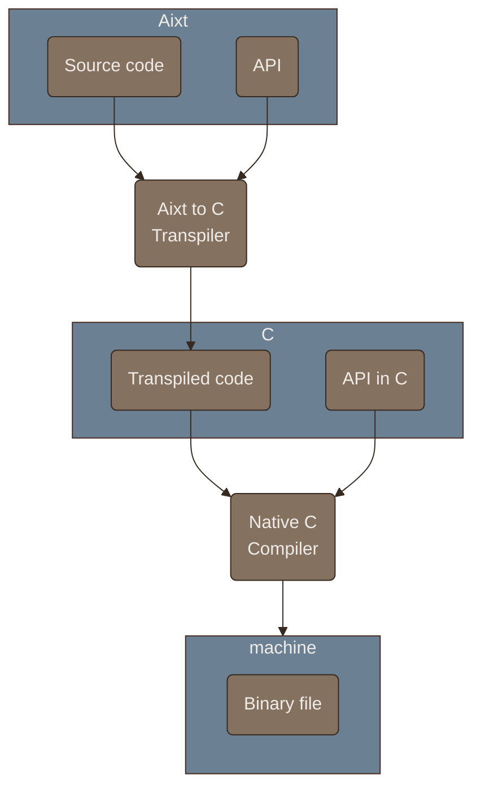
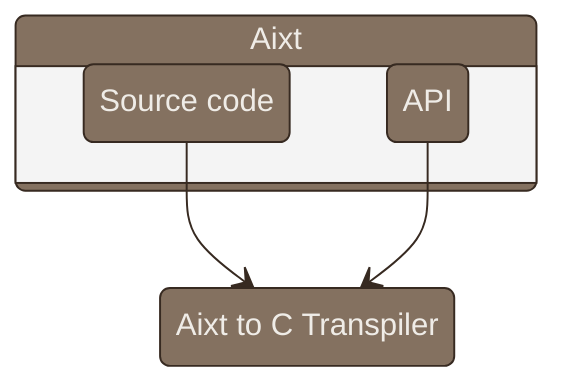

```mermaid
%%{ init: { 'theme': 'base', 
            'themeVariables': { 'primaryColor': '#847160',
                                'secondaryColor': '#6f7c84',
                                'primaryTextColor': '#efece7',
                                'primaryBorderColor': '#372a21',
                                'tertiaryTextColor': '#c3c2f',
                                'tertiaryBorderColor': '#472a21',
                                'lineColor': '#372a21'
                              }
          }
}%%

flowchart TB

    subgraph Aixt
    SC(Source code)
    API(API)
    end

    subgraph C
    TC(Transpiled code)
    API_C(API in C) 
    end
    
    subgraph machine
    BF(Binary file)
    end

    SC  --> TR(Aixt to C\nTranspiler)
    API --> TR
    TR  --> TC

    TC    --> NC(Native C\nCompiler)
    API_C --> NC
    NC    --> machine

%% general block diagram in mermaid.js
%% converted in svg image by using https://mermaid.live/edit
```

```mermaid
%%{ init: { 'theme': 'base', 
            'themeVariables': { 'primaryColor': '#847160',
                                'secondaryColor': '#6f7c84',
                                'primaryTextColor': '#efece7',
                                'primaryBorderColor': '#372a21',
                                'tertiaryTextColor': '#c3c2f',
                                'tertiaryBorderColor': '#472a21',
                                'lineColor': '#372a21'
                              }
          }
}%%

stateDiagram-v2

    Aixt
    state Aixt {
        SC: Source code
        API
        }

    Aixt2C: Aixt to C Transpiler

    SC  --> Aixt2C
    API --> Aixt2C 

    %%subgraph C
    %%TC(Transpiled code)
    %%API_C(API in C) 
    %%end
    %%
    %%subgraph machine
    %%BF(Binary file)
    %%end
%%
    %%SC  --> TR(Aixt to C\nTranspiler)
    %%API --> TR
    %%TR  --> TC
%%
    %%TC    --> NC(Native C\nCompiler)
    %%API_C --> NC
    %%NC    --> machine

%% general block diagram in mermaid.js
%% converted in svg image by using https://mermaid.live/edit
```