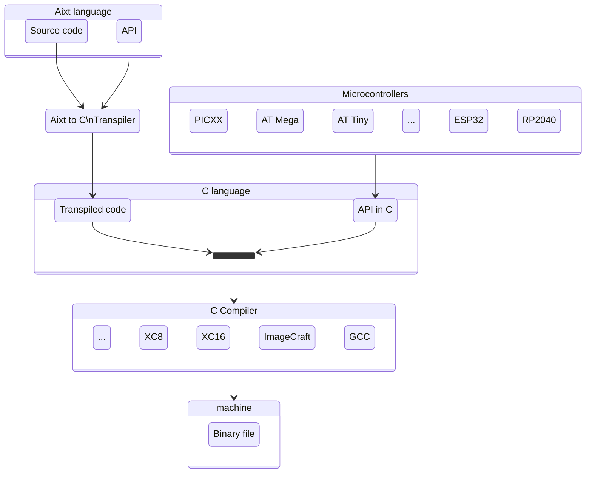

```mermaid
stateDiagram-v2

    Aixt: Aixt language
    state Aixt {
        source: Source code
        API
    }

    Aixt2C: Aixt to C\nTranspiler

    C: C language
    state C {
        state join_C <<fork>>
        Tr_Code: Transpiled code
        API_C: API in C
        Tr_Code --> join_C
        API_C --> join_C
    }

    state Microcontrollers {
        PICs: PICXX
        ATM: AT Mega
        ATT: AT Tiny
        others2: ...
        ESP32
        RP2040
    }

    C_Compiler: C Compiler
    state C_Compiler {
        others: ...
        XC8  
        XC16 
        ImageCraft  
        others 
        GCC 
    }
    
    machine
    state machine {
        BF: Binary file
    }
    
    source  --> Aixt2C
    API     --> Aixt2C 
    Aixt2C  --> Tr_Code

    join_C     --> C_Compiler

    C_Compiler  --> machine

    Microcontrollers --> API_C
```