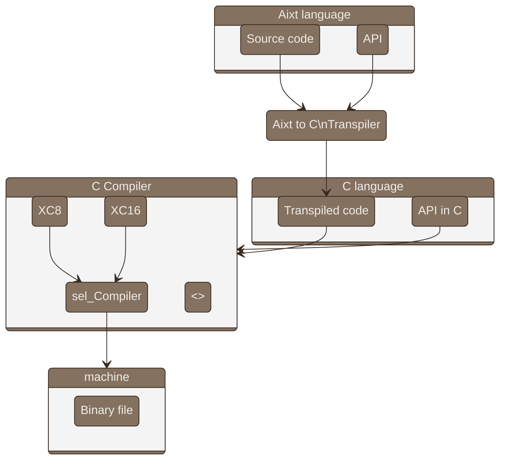

```mermaid
%%{ init: { 'theme': 'base', 
            'themeVariables': { 'primaryColor': '#847160',
                                'secondaryColor': '#6f7c84',
                                'primaryTextColor': '#efece7',
                                'primaryBorderColor': '#372a21',
                                'tertiaryTextColor': '#c3c2f',
                                'tertiaryBorderColor': '#472a21',
                                'lineColor': '#372a21'
                              }
          }
}%%

stateDiagram-v2

    Aixt: Aixt language
    state Aixt {
        source: Source code
        API
    }

    Aixt2C: Aixt to C\nTranspiler

    C: C language
    state C {
        Tr_Code: Transpiled code
        API_C: API in C
    }

    C_Compiler: C Compiler
    state C_Compiler {
        sel_Compiler <<fork>>
        XC8  --> sel_Compiler
        XC16 --> sel_Compiler
    }
    
    machine
    state machine {
        BF: Binary file
    }
    
    source  --> Aixt2C
    API     --> Aixt2C 
    Aixt2C  --> Tr_Code

    Tr_Code     --> C_Compiler
    API_C       --> C_Compiler
    sel_Compiler  --> machine

%% general block diagram in mermaid.js
%% converted in svg image by using https://mermaid.live/edit
```