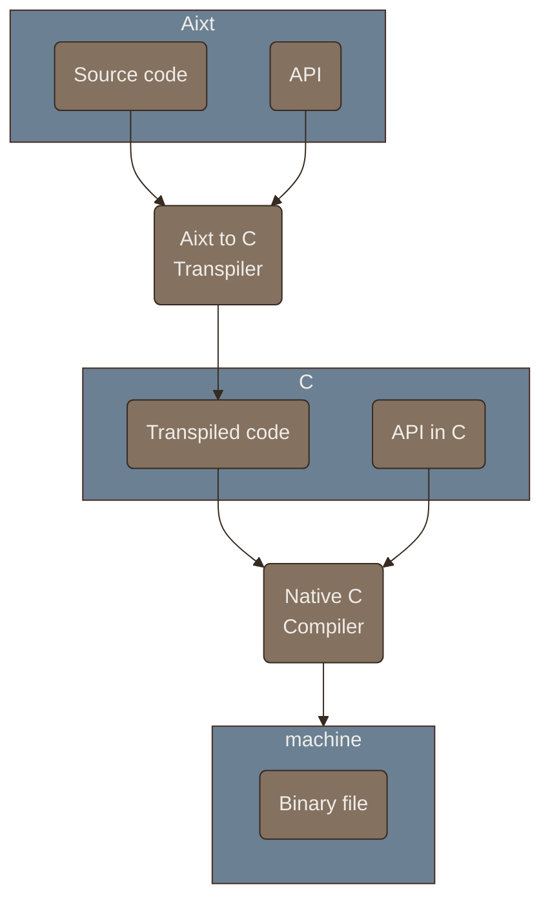
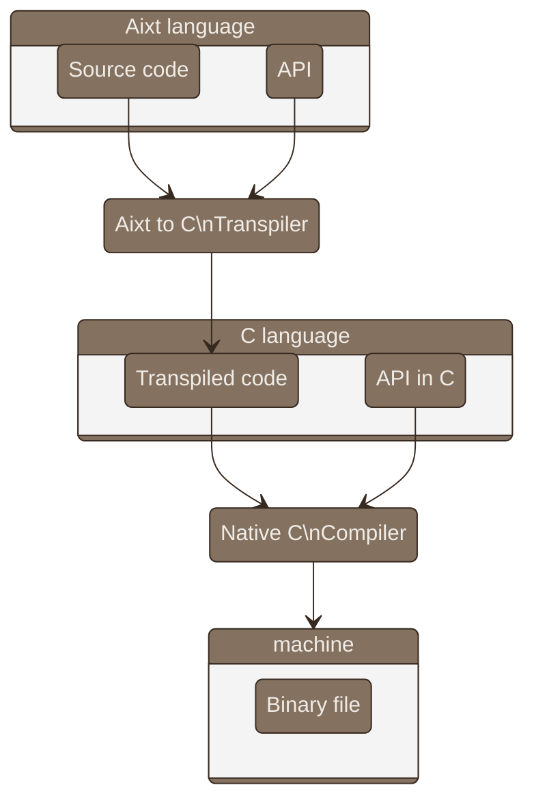

```mermaid
%%{ init: { 'theme': 'base', 
            'themeVariables': { 'primaryColor': '#847160',
                                'secondaryColor': '#6f7c84',
                                'primaryTextColor': '#efece7',
                                'primaryBorderColor': '#372a21',
                                'tertiaryTextColor': '#c3c2f',
                                'tertiaryBorderColor': '#472a21',
                                'lineColor': '#372a21'
                              }
          }
}%%

flowchart TB

    subgraph Aixt
    SC(Source code)
    API(API)
    end

    subgraph C
    TC(Transpiled code)
    API_C(API in C) 
    end
    
    subgraph machine
    BF(Binary file)
    end

    SC  --> TR(Aixt to C\nTranspiler)
    API --> TR
    TR  --> TC

    TC    --> NC(Native C\nCompiler)
    API_C --> NC
    NC    --> machine

%% general block diagram in mermaid.js
%% converted in svg image by using https://mermaid.live/edit
```

```mermaid
%%{ init: { 'theme': 'base', 
            'themeVariables': { 'primaryColor': '#847160',
                                'secondaryColor': '#6f7c84',
                                'primaryTextColor': '#efece7',
                                'primaryBorderColor': '#372a21',
                                'tertiaryTextColor': '#c3c2f',
                                'tertiaryBorderColor': '#472a21',
                                'lineColor': '#372a21'
                              }
          }
}%%

stateDiagram-v2

    Aixt: Aixt language
    state Aixt {
        SC: Source code
        API
    }

    Aixt2C: Aixt to C\nTranspiler

    C: C language
    state C {
        TC: Transpiled code
        API_C: API in C
    }

    NC: Native C\nCompiler
    
    machine
    state machine {
        BF: Binary file
    }
    
    SC      --> Aixt2C
    API     --> Aixt2C 
    Aixt2C  --> TC

    TC      --> NC
    API_C   --> NC
    NC      --> machine

%% general block diagram in mermaid.js
%% converted in svg image by using https://mermaid.live/edit
```